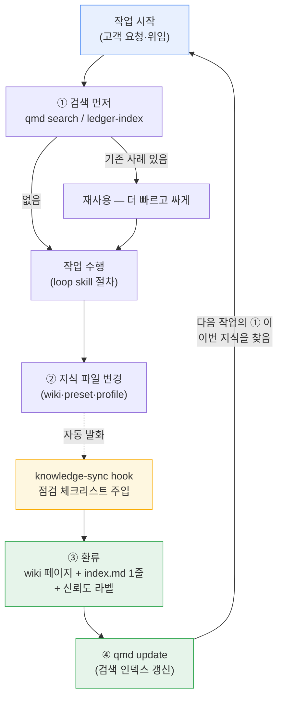
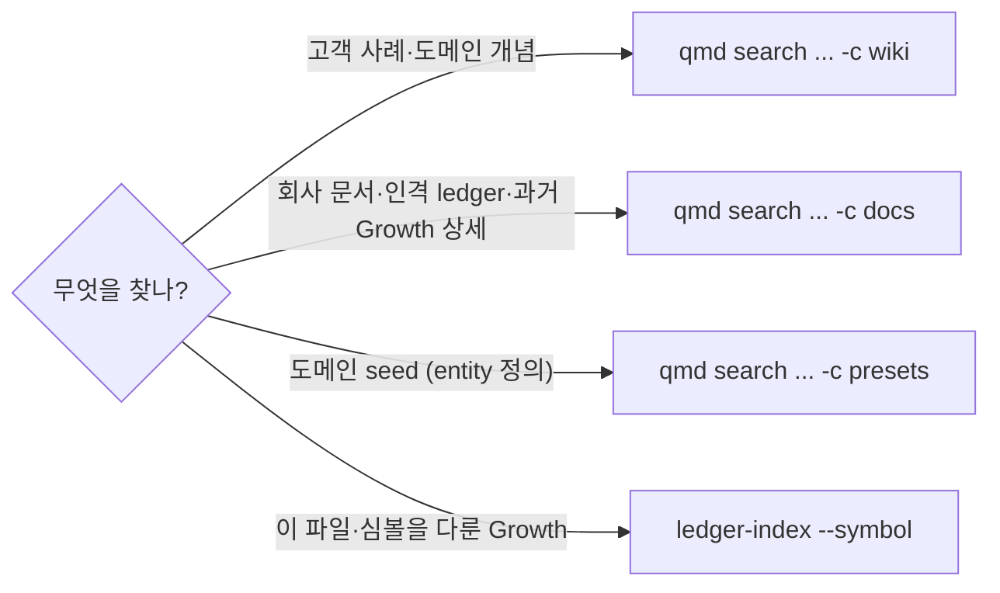

# 지식관리 사용자 가이드

> Growth-18~22 에서 구축한 지식관리 체계의 사용자 가이드. 대상: CEO (비전문 사용 OK) + AI 인격 전원. 설계 배경: [`docs/architecture/llm-wiki-adoption.md`](../architecture/llm-wiki-adoption.md).

## 1. 한눈에 — 무엇이 생겼나

| 도구 | 한 줄 특징 | 위치 / 명령 |
|---|---|---|
| **회사 Wiki** | 고객·도메인 지식이 누적되는 markdown wiki. LLM 이 쓰고 유지, 인간은 소스와 질문만 (Karpathy 패턴) | `knowledge/wiki/` (규약: 그 안의 README.md) |
| **index.md** | wiki 의 목차 — 페이지당 1줄. 모든 지식 추가가 여기 1줄을 남김 | `knowledge/wiki/index.md` |
| **신뢰도 라벨** | 모든 주장에 출처 등급: `[EXTRACTED]` (고객이 말함) / `[INFERRED]` (우리 추론) / `[AMBIGUOUS]` / `[UNVERIFIED]` | wiki 페이지 본문 |
| **qmd 검색** | 자연어로 wiki·문서·preset 을 검색. 완전 로컬 (API 비용 0) | `qmd search "<질의>" -c wiki` |
| **ledger-index** | "이 파일/심볼을 어느 Growth 가 다뤘나" 역추적. main 원장 담당 | `python scripts/ledger-index.py --symbol <이름>` |
| **지식그래프** | wiki 페이지 연결을 한 장의 그림으로 — 브라우저 더블클릭, 서버 불필요 | `python scripts/wiki/build_graph.py` → `out/wiki-graph.html` |
| **knowledge-sync hook** | 지식 파일이 변경되면 자동으로 "점검 체크리스트" 를 작업 중인 AI 에게 주입 | 자동 (설정: `.claude/settings.json`) |
| **6 loop skill** | 인격별 실행 절차 — 전부 "시작은 검색, 종료는 환류" 가 박혀 있음 | `.claude/skills/<role>-loop/` |
| **growth-archive** | 원장이 비대해지면 오래된 엔트리를 옮기는 회전 보관소 | `docs/learn-logs/growth-archive.md` |

## 2. 지식 순환 프로세스 — 한 장 다이어그램

지식이 **쓰이고 → 저장되고 → 다음 작업을 똑똑하게 만드는** 복리 사이클:

핵심: **①번과 ③번이 모든 인격의 loop skill 에 의무로 박혀 있고**, ②→③ 사이를 hook 이 자동으로 챙겨줍니다. 사람이 기억할 것은 없습니다.

## 3. 검색 — 무엇을 어디서 찾나

- 지식을 **추가·수정한 직후엔 `qmd update`** — 안 하면 검색이 옛날 상태를 봅니다 (hook 이 알려줌).
- 시맨틱 검색 (`qmd query`) 은 선택 — 최초 1회 `qmd embed` (로컬 모델 다운로드) 후 사용.

## 4. 역할별 사용법

### CEO (비전문 사용)
- **지식 지형 보기**: `python scripts/wiki/build_graph.py` 실행 후 `out/wiki-graph.html` 더블클릭 — 서버·설치 없이 브라우저에서 지식그래프 탐색.
- **궁금한 것 찾기**: 터미널에 `qmd search "월 마감 자동화" -c wiki` 처럼 자연어로.
- **Obsidian 으로 열람** (선택): repo 폴더를 Obsidian vault 로 열면 `[[링크]]`·그래프 뷰가 그대로 작동. 읽기 전용 viewer 로만 — 편집은 AI 인격이.

### AI 인격 (agent)
- 각자의 loop skill 을 따르면 됨 — 시작-검색·종료-환류가 절차에 포함.
- 고객 관련 주장에는 **신뢰도 라벨 필수** — 고객 약속의 근거는 `[EXTRACTED]` 만 인정 (honest-promise).
- hook 체크리스트가 뜨면 ①~⑤ 를 그 자리에서 처리 (미루지 않음 — "다음에 정리하자" 는 원칙 위반 신호).

## 5. 자주 묻는 것

| 질문 | 답 |
|---|---|
| 비용이 드나? | qmd·graph·hook 전부 로컬 — API 비용 0. LLM 증분은 환류 작성 turn (~$0.1/건) |
| 지식이 잘못 들어가면? | wiki 는 git — 모든 변경이 커밋 이력. lint (분기 synthesis) 가 모순·고아 페이지 점검 |
| 원장이 또 비대해지면? | G-9 가드가 200행 cap 감시 — cap 접근 시 growth-archive 로 회전 (Growth-20 절차) |
| 고객 비밀이 들어가면? | raw 보관·사례 환류 모두 **PII 제거** 가 규약 (wiki README·pm loop) |
