# D4 ERD — 법무법인 통합 업무관리 (lawfirm-demo)

> `docs/projects/lawfirm-demo/` D4 슬롯 산출물.
> 4도메인 14엔티티. 스키마 정합 기준: `out/lawfirm-demo/ddl/postgres.sql` (scaffold DDL) +
> `scripts/demo/seed_lawfirm_full.py` (INSERT 컬럼 직접 확인).
> 가명 데이터 사용 — 실존 인물·법인·사건과 무관.

---

## 1. 도메인 개요

| 도메인 | 테이블 수 | 시드 건수 (합계) |
|---|---|---|
| legal (법무) | 4 | 72 (사건10 + 판례12 + 당사자28 + 사건문서22) |
| hr (인사) | 2 | 19 (직원14 + 부서5) |
| document (문서관리) | 4 | 38 (문서10 + 버전14 + 카테고리6 + 접근규칙8) |
| approval (전자결재) | 4 | 44 (요청7 + 단계13 + 결재자14 + 결정10) |
| **합계** | **14** | **173** |

---

## 2. 전체 통합 ERD (Mermaid erDiagram)

> 도메인 간 cross-domain FK 및 모든 관계를 포함한 통합도.

```mermaid
erDiagram

    %% ─── HR 도메인 ──────────────────────────────────────────────────────────
    hr_department {
        uuid        id              PK
        varchar32   code            UK
        varchar255  name
        uuid        parent_id       FK "→ hr_department.id (자기참조) SET NULL"
        uuid        manager_id      FK "→ hr_employee.id SET NULL (지연 FK)"
        timestamptz created_at
        timestamptz updated_at
    }

    hr_employee {
        uuid        id              PK
        varchar64   employee_number UK
        varchar255  full_name
        uuid        department_id   FK "→ hr_department.id ON DELETE RESTRICT"
        uuid        position_id     "NULL허용 (직급 미사용)"
        date        hire_date
        varchar     status          "active|on-leave|terminated"
        timestamptz created_at
        timestamptz updated_at
    }

    %% ─── Legal 도메인 ───────────────────────────────────────────────────────
    legal_case {
        uuid        id              PK
        varchar64   case_number     UK
        varchar255  title
        varchar     case_type       "civil|criminal|administrative|family|commercial"
        varchar     status          "intake|active|trial|appeal|closed|withdrawn"
        date        filed_date
        varchar255  court           "NULL허용 (중재 등)"
        date        next_hearing_date "NULL허용"
        uuid        assigned_attorney_id FK "→ hr_employee.id ON DELETE RESTRICT"
        uuid        client_contact_id    "NULL허용 (미구현 cross-domain 예약)"
        text        summary
        timestamptz created_at
        timestamptz updated_at
    }

    legal_precedent {
        uuid        id              PK
        varchar128  citation        UK "법원 사건번호 (예: 대법원 2020다12345)"
        varchar255  court
        date        decided_date
        varchar     case_type       "civil|criminal|administrative|family|commercial"
        text        holding         "판시 요지"
        text        full_text       "NULL허용"
        varchar255  keywords        "공백구분 키워드"
        timestamptz created_at
        timestamptz updated_at
    }

    legal_case_party {
        uuid        id          PK
        uuid        case_id     FK "→ legal_case.id ON DELETE CASCADE"
        varchar     role        "plaintiff|defendant|witness|opposing-counsel|expert-witness"
        varchar255  name        "PII — 가명 처리"
        uuid        contact_id  "NULL허용 (미구현 cross-domain 예약)"
        varchar255  notes
        timestamptz created_at
        timestamptz updated_at
    }

    legal_case_document {
        uuid        id              PK
        uuid        case_id         FK "→ legal_case.id ON DELETE CASCADE"
        varchar     document_type   "complaint|brief|evidence|court-order|contract|correspondence|other"
        varchar255  title
        timestamptz filed_at        "NULL허용"
        varchar255  storage_key     "파일 저장 경로/키 (NULL허용)"
        varchar255  notes           "NULL허용"
        text        content_text    "ingest pipeline 추출 평문 (NULL=미처리)"
        varchar     ingest_status   "pending|processing|done|error (NULL허용)"
        timestamptz ingested_at     "NULL허용"
        timestamptz created_at
        timestamptz updated_at
    }

    %% ─── Document 도메인 ────────────────────────────────────────────────────
    document_category {
        uuid        id              PK
        varchar32   code            UK
        varchar255  name
        uuid        parent_id       FK "→ document_category.id SET NULL (자기참조)"
        integer     default_retention_days "NULL허용"
        timestamptz created_at
        timestamptz updated_at
    }

    document_document {
        uuid        id                  PK
        varchar255  title
        uuid        category_id         FK "→ document_category.id ON DELETE RESTRICT"
        uuid        owner_id            FK "→ hr_employee.id ON DELETE RESTRICT"
        varchar     status              "draft|published|archived|deleted"
        uuid        current_version_id  FK "→ document_version.id (지연 FK; NULL=초기)"
        date        retention_date      "NULL허용"
        timestamptz created_at
        timestamptz updated_at
    }

    document_version {
        uuid        id              PK
        uuid        document_id     FK "→ document_document.id ON DELETE CASCADE"
        varchar32   version_number
        uuid        uploaded_by     FK "→ hr_employee.id ON DELETE RESTRICT"
        varchar255  file_name
        integer     file_size_bytes
        varchar128  mime_type
        varchar255  storage_key
        varchar64   checksum
        boolean     is_published
        timestamptz created_at
        timestamptz updated_at
    }

    document_access_rule {
        uuid        id              PK
        uuid        document_id     FK "→ document_document.id ON DELETE CASCADE"
        varchar     principal_type  "employee|department|role"
        uuid        principal_id    "다형 참조 (hr_employee.id 또는 hr_department.id — 앱 레이어 적용)"
        varchar     permission      "read|edit|admin"
        timestamptz expires_at      "NULL=무기한"
        timestamptz created_at
        timestamptz updated_at
    }

    %% ─── Approval 도메인 ────────────────────────────────────────────────────
    approval_request {
        uuid        id              PK
        varchar64   subject_type    "leave|expense|contract|dispatch|purchase"
        uuid        subject_id      "다형 참조 (hr_employee.id 등 — 앱 레이어 적용)"
        uuid        requester_id    FK "→ hr_employee.id ON DELETE RESTRICT"
        varchar     status          "pending|in-progress|approved|rejected|cancelled|expired"
        varchar255  title
        timestamptz expires_at      "NULL허용"
        timestamptz created_at
        timestamptz updated_at
    }

    approval_step {
        uuid        id          PK
        uuid        request_id  FK "→ approval_request.id ON DELETE CASCADE"
        integer     sequence    "단계 순서 (UK: request_id + sequence)"
        varchar255  name
        varchar     status      "pending|active|approved|rejected|skipped"
        boolean     requires_all "true=전원동의, false=과반"
        timestamptz created_at
        timestamptz updated_at
    }

    approval_approver {
        uuid        id          PK
        uuid        step_id     FK "→ approval_step.id ON DELETE CASCADE"
        uuid        employee_id FK "→ hr_employee.id ON DELETE RESTRICT"
        timestamptz notified_at   "NULL=미통보"
        timestamptz responded_at  "NULL=미응답"
        timestamptz created_at
        timestamptz updated_at
    }

    approval_decision {
        uuid        id          PK
        uuid        step_id     FK "→ approval_step.id ON DELETE RESTRICT"
        uuid        approver_id FK "→ approval_approver.id ON DELETE RESTRICT"
        varchar     decision    "approved|rejected"
        varchar255  comment     "NULL허용"
        timestamptz decided_at
        timestamptz created_at
        timestamptz updated_at
    }

    %% ─── 관계 ────────────────────────────────────────────────────────────────

    %% HR 내부
    hr_department       ||--o{ hr_employee           : "소속(department_id)"
    hr_department       ||--o{ hr_department          : "상위부서(parent_id 자기참조)"
    hr_employee         |o--o{ hr_department          : "관리자(manager_id 지연 FK)"

    %% Legal — HR cross-domain FK
    hr_employee         ||--o{ legal_case             : "담당변호사(assigned_attorney_id)"

    %% Legal 내부
    legal_case          ||--o{ legal_case_party       : "사건 당사자"
    legal_case          ||--o{ legal_case_document    : "사건 서류(append-only 권장)"

    %% Document — HR cross-domain FK
    hr_employee         ||--o{ document_document      : "문서 소유자(owner_id)"
    hr_employee         ||--o{ document_version       : "버전 업로더(uploaded_by)"
    document_category   ||--o{ document_document      : "카테고리"
    document_category   ||--o{ document_category      : "상위카테고리(자기참조)"

    %% Document 내부
    document_document   ||--o{ document_version       : "버전 이력"
    document_document   |o--|| document_version       : "현행버전(current_version_id 지연 FK)"
    document_document   ||--o{ document_access_rule   : "접근규칙(ON DELETE CASCADE)"

    %% Approval — HR cross-domain FK
    hr_employee         ||--o{ approval_request       : "상신자(requester_id)"
    hr_employee         ||--o{ approval_approver      : "결재자(employee_id)"

    %% Approval 내부
    approval_request    ||--o{ approval_step          : "결재단계(ON DELETE CASCADE)"
    approval_step       ||--o{ approval_approver      : "단계 결재자(ON DELETE CASCADE)"
    approval_approver   ||--o{ approval_decision      : "결재결정"
    approval_step       ||--o{ approval_decision      : "단계별 결정(ON DELETE RESTRICT)"
```

---

## 3. 도메인별 엔티티 상세

### 3-1. HR 도메인

#### hr_department (부서)

| 항목 | 내용 |
|---|---|
| PK | `id` (UUID) |
| UK | `code` |
| FK | `parent_id` → `hr_department.id` ON DELETE SET NULL (자기참조, 계층 부서). `manager_id` → `hr_employee.id` ON DELETE SET NULL (지연 FK — 직원 INSERT 후 ALTER ADD FK) |
| 카디널리티 | 부서:부서 = 1:N (상위/하위). 부서:직원 = 1:N |
| 인덱스 | B-Tree(`parent_id`) |
| 시드 | 5개 (소송부/송무2팀/기업자문팀/가사·형사팀/지원팀) |
| 특이 | manager_id 는 직원 INSERT 후 UPDATE로 설정 (FK 순환 회피). 5개 부서 각각 관리자 1명 배정. |

#### hr_employee (직원)

| 항목 | 내용 |
|---|---|
| PK | `id` (UUID) |
| UK | `employee_number` |
| FK | `department_id` → `hr_department.id` ON DELETE RESTRICT |
| CHECK | `status` IN ('active', 'on-leave', 'terminated') |
| 카디널리티 | 부서:직원 = 1:N |
| 인덱스 | B-Tree(`department_id`), B-Tree(`status`) |
| 시드 | 14명 (EMP001~EMP014). EMP014 권현우 = on-leave. position_id 는 전원 NULL (직급 테이블 미구현) |

---

### 3-2. Legal 도메인

#### legal_case (사건)

| 항목 | 내용 |
|---|---|
| PK | `id` (UUID) |
| UK | `case_number` |
| FK | `assigned_attorney_id` → `hr_employee.id` ON DELETE RESTRICT (cross-domain) |
| CHECK | `case_type` IN (civil/criminal/administrative/family/commercial). `status` IN (intake/active/trial/appeal/closed/withdrawn) |
| 카디널리티 | 직원:사건 = 1:N. 사건:당사자 = 1:N. 사건:사건문서 = 1:N |
| 인덱스 | B-Tree(`status`), B-Tree(`assigned_attorney_id`), B-Tree(`next_hearing_date`) |
| 시드 | 10건 (CASE-2024-001~CASE-2025-003). 상태분포: intake1/active3/trial3/appeal1/closed2 |
| 특이 | `client_contact_id` NULL허용 — 미구현 cross-domain 예약 필드. `court` NULL허용 (중재 사건 C6 = NULL) |

#### legal_precedent (판례)

| 항목 | 내용 |
|---|---|
| PK | `id` (UUID) |
| UK | `citation` |
| FK | 없음 (독립 지식 기반) |
| CHECK | `case_type` IN (civil/criminal/administrative/family/commercial) |
| 카디널리티 | 독립 엔티티 (lawfirm-demo에서는 사건과 직접 FK 연결 없음) |
| 인덱스 | B-Tree(`case_type`), B-Tree(`decided_date`). 별도 GIN idx: `idx_precedent_fts` ON `to_tsvector('simple', holding || ' ' || COALESCE(keywords, ''))` (setup_lawfirm.py Step 2에서 추가) |
| 시드 | 12건. civil5/family2/criminal2/commercial2/administrative1 |
| 특이 | `keywords` 공백구분 문자열 — 1NF 위배. 현재 FTS 검색으로 충분. `full_text` NULL=12건 전부 (원문 미제공) |

#### legal_case_party (사건 당사자)

| 항목 | 내용 |
|---|---|
| PK | `id` (UUID) |
| FK | `case_id` → `legal_case.id` ON DELETE CASCADE |
| CHECK | `role` IN (plaintiff/defendant/witness/opposing-counsel/expert-witness) |
| 카디널리티 | 사건:당사자 = 1:N (사건당 2~4명) |
| 인덱스 | B-Tree(`case_id`), B-Tree(`role`) |
| 시드 | 28건. C7(이중매매)에 피고 2명(동일 사건, 다른 역할) — role 별 복수 참여 허용 |
| 특이 | `name` PII 포함 (가명 처리). `contact_id` NULL=전건 (미구현 cross-domain 예약) |

#### legal_case_document (사건 문서)

| 항목 | 내용 |
|---|---|
| PK | `id` (UUID) |
| FK | `case_id` → `legal_case.id` ON DELETE CASCADE |
| CHECK | `document_type` IN (complaint/brief/evidence/court-order/contract/correspondence/other). `ingest_status` IN (pending/processing/done/error) |
| 카디널리티 | 사건:사건문서 = 1:N (사건당 2~3건) |
| 인덱스 | B-Tree(`case_id`), B-Tree(`document_type`), B-Tree(`ingest_status`) |
| 시드 | 22건. ingest_status 분포: done15/pending5/error2 |
| 특이 | `content_text` NULL=전건 (ingest pipeline 미실행). `storage_key` 는 상대 경로 — 실제 파일 없음 (데모용) |

---

### 3-3. Document 도메인

#### document_category (카테고리)

| 항목 | 내용 |
|---|---|
| PK | `id` (UUID) |
| UK | `code` |
| FK | `parent_id` → `document_category.id` ON DELETE SET NULL (자기참조 계층) |
| 카디널리티 | 카테고리:카테고리 = 1:N. 카테고리:문서 = 1:N |
| 인덱스 | B-Tree(`parent_id`) |
| 시드 | 6개 (소송서류/계약서/내부규정/인사서류/회계서류/서식·템플릿). 전부 parent_id=NULL (flat 구조) |

#### document_document (문서)

| 항목 | 내용 |
|---|---|
| PK | `id` (UUID) |
| FK | `category_id` → `document_category.id` ON DELETE RESTRICT. `owner_id` → `hr_employee.id` ON DELETE RESTRICT. `current_version_id` → `document_version.id` (지연 FK — 버전 INSERT 후 UPDATE로 설정) |
| CHECK | `status` IN (draft/published/archived/deleted) |
| 카디널리티 | 카테고리:문서 = 1:N. 직원:문서(소유) = 1:N. 문서:버전 = 1:N |
| 인덱스 | B-Tree(`category_id`), B-Tree(`status`) |
| 시드 | 10건. 상태: published8/archived1/draft1 |
| 특이 | `current_version_id` 는 버전 INSERT 후 UPDATE로 설정 (순환 FK 회피). 초기값 NULL, 이후 backfill |

#### document_version (버전)

| 항목 | 내용 |
|---|---|
| PK | `id` (UUID) |
| UK | `(document_id, version_number)` |
| FK | `document_id` → `document_document.id` ON DELETE CASCADE. `uploaded_by` → `hr_employee.id` ON DELETE RESTRICT |
| 카디널리티 | 문서:버전 = 1:N (문서당 v1만 있는 경우 or v1+v2) |
| 인덱스 | B-Tree(`document_id`) |
| 시드 | 14건. v2.0이 있는 문서: DOC1/DOC2/DOC3/DOC5 — 나머지 6건은 v1.0만 |

#### document_access_rule (접근규칙)

| 항목 | 내용 |
|---|---|
| PK | `id` (UUID) |
| UK | `(document_id, principal_type, principal_id)` |
| FK | `document_id` → `document_document.id` ON DELETE CASCADE |
| CHECK | `principal_type` IN (employee/department/role). `permission` IN (read/edit/admin) |
| 카디널리티 | 문서:접근규칙 = 1:N |
| 인덱스 | B-Tree(`document_id`) |
| 시드 | 8건. principal_type=department 6건 / employee 2건. expires_at: NULL=무기한 6건 / 기한부 2건 |
| 특이 | `principal_id` 다형 참조 — `principal_type=department` 이면 `hr_department.id`, `=employee` 이면 `hr_employee.id`. DB FK 없음, 앱 레이어 적용 |

---

### 3-4. Approval 도메인

#### approval_request (결재요청)

| 항목 | 내용 |
|---|---|
| PK | `id` (UUID) |
| FK | `requester_id` → `hr_employee.id` ON DELETE RESTRICT |
| CHECK | `status` IN (pending/in-progress/approved/rejected/cancelled/expired) |
| 카디널리티 | 직원:결재요청 = 1:N. 결재요청:결재단계 = 1:N |
| 인덱스 | B-Tree(`subject_type`, `subject_id`), B-Tree(`status`) |
| 시드 | 7건. 상태: approved4/rejected1/in-progress1/pending1. subject_type: leave2/expense1/contract2/dispatch1/purchase1 |
| 특이 | `subject_id` 다형 참조 (hr_employee.id / legal_case.id / legal_case_document.id 등 — 앱 레이어 적용). DB FK 없음 |

#### approval_step (결재단계)

| 항목 | 내용 |
|---|---|
| PK | `id` (UUID) |
| UK | `(request_id, sequence)` |
| FK | `request_id` → `approval_request.id` ON DELETE CASCADE |
| CHECK | `status` IN (pending/active/approved/rejected/skipped) |
| 카디널리티 | 결재요청:결재단계 = 1:N (요청당 1~3단계) |
| 인덱스 | B-Tree(`request_id`) |
| 시드 | 13건. 1단계만: AQ1/AQ4. 2단계: AQ2/AQ3/AQ5/AQ7. 3단계: AQ6 |

#### approval_approver (결재자)

| 항목 | 내용 |
|---|---|
| PK | `id` (UUID) |
| UK | `(step_id, employee_id)` |
| FK | `step_id` → `approval_step.id` ON DELETE CASCADE. `employee_id` → `hr_employee.id` ON DELETE RESTRICT |
| 카디널리티 | 결재단계:결재자 = 1:N (단계당 1~2명). 직원:결재자역할 = 1:N |
| 인덱스 | B-Tree(`step_id`) |
| 시드 | 14건. AQ1 step1에 결재자 2명 (EMP001+E4 — requires_all=True 전원동의 패턴) |

#### approval_decision (결재결정)

| 항목 | 내용 |
|---|---|
| PK | `id` (UUID) |
| UK | `(step_id, approver_id)` |
| FK | `step_id` → `approval_step.id` ON DELETE RESTRICT. `approver_id` → `approval_approver.id` ON DELETE RESTRICT |
| CHECK | `decision` IN (approved/rejected) |
| 카디널리티 | 결재자:결재결정 = 1:N (결재자당 결정 1건) |
| 인덱스 | B-Tree(`step_id`) |
| 시드 | 10건. approved9/rejected1 (AQ4 한소율 연차 반려) |

---

## 4. 도메인 간 경계 (Cross-Domain FK)

| FK | 방향 | 종류 | ON DELETE |
|---|---|---|---|
| `legal_case.assigned_attorney_id` | legal → hr | 물리 FK (DDL) | RESTRICT |
| `document_document.owner_id` | document → hr | 물리 FK (DDL) | RESTRICT |
| `document_version.uploaded_by` | document → hr | 물리 FK (DDL) | RESTRICT |
| `approval_request.requester_id` | approval → hr | 물리 FK (DDL) | RESTRICT |
| `approval_approver.employee_id` | approval → hr | 물리 FK (DDL) | RESTRICT |
| `legal_case.client_contact_id` | legal → (미구현) | 예약 필드 (NULL=전건) | 앱 레이어 (미구현) |
| `legal_case_party.contact_id` | legal → (미구현) | 예약 필드 (NULL=전건) | 앱 레이어 (미구현) |
| `document_access_rule.principal_id` | document → hr (다형) | 앱 레이어 | 앱 레이어 |
| `approval_request.subject_id` | approval → (다형) | 앱 레이어 | 앱 레이어 |

**핵심**: legal 도메인은 `assigned_attorney_id` 를 통해 hr_employee 를 참조한다. 이것이 법무-인사 도메인 간 유일한 물리 FK 연결이다. 나머지 cross-domain 참조는 다형 UUID 예약 필드이며 앱 레이어에서 관리한다.

---

## 5. 정규화 수준 및 반정규화 결정

| 항목 | 상태 | 근거 |
|---|---|---|
| 전반 정규화 수준 | 3NF (BCNF 부분 적용) | 14개 테이블 모두 이행적 종속성 없음 |
| `legal_precedent.keywords` 공백구분 문자열 | 1NF 위배 | FTS GIN 인덱스로 검색 충족. 별도 태그 테이블 불필요 (데모 규모) |
| `document_document.current_version_id` 지연 FK | 반정규화 (순환 참조 회피) | 버전 INSERT 후 UPDATE로 backfill. 순환 FK (document → version → document) 회피를 위한 의도적 구조 |
| `hr_department.manager_id` 지연 FK | 반정규화 (순환 참조 회피) | 직원 INSERT 후 UPDATE. 부서와 직원의 상호 참조 회피 |
| `document_access_rule.principal_id` 다형 참조 | 물리 FK 없음 | principal_type 에 따라 hr_employee 또는 hr_department 참조. 단일 테이블로 read/edit/admin 3종 권한 통합 관리 — 분리 시 복잡도 증가 |
| `approval_request.subject_id` 다형 참조 | 물리 FK 없음 | subject_type 에 따라 다른 테이블 참조. leave/expense/contract/dispatch/purchase 5종 통합 |

---

## 6. 인덱스 설계 요약

| 테이블 | 인덱스 | 종류 | 목적 |
|---|---|---|---|
| hr_department | `idx_hr_department_parent_id` | B-Tree | 계층 조회 |
| hr_employee | `idx_hr_employee_department_id` | B-Tree | 부서별 직원 목록 |
| hr_employee | `idx_hr_employee_status` | B-Tree | 재직 상태 필터 |
| legal_case | `idx_legal_case_status` | B-Tree | 상태별 사건 목록 |
| legal_case | `idx_legal_case_assigned_attorney_id` | B-Tree | 담당 변호사별 사건 |
| legal_case | `idx_legal_case_next_hearing_date` | B-Tree | 기일 알림·정렬 |
| legal_case_party | `idx_legal_case_party_case_id` | B-Tree | 사건별 당사자 |
| legal_case_party | `idx_legal_case_party_role` | B-Tree | 역할별 필터 |
| legal_case_document | `idx_legal_case_document_case_id` | B-Tree | 사건별 문서 |
| legal_case_document | `idx_legal_case_document_document_type` | B-Tree | 문서 유형 필터 |
| legal_case_document | `idx_legal_case_document_ingest_status` | B-Tree | 색인 대기 폴링 |
| legal_precedent | `idx_legal_precedent_case_type` | B-Tree | 사건 유형 필터 |
| legal_precedent | `idx_legal_precedent_decided_date` | B-Tree | 날짜 정렬 |
| legal_precedent | `idx_precedent_fts` | GIN (tsvector) | 한국어 FTS (setup_lawfirm.py Step 2) |
| document_category | `idx_document_category_parent_id` | B-Tree | 계층 카테고리 |
| document_document | `idx_document_document_category_id` | B-Tree | 카테고리별 문서 |
| document_document | `idx_document_document_status` | B-Tree | 상태별 문서 |
| document_access_rule | `idx_document_access_rule_document_id` | B-Tree | 문서별 접근규칙 조회 |
| document_version | `idx_document_version_document_id` | B-Tree | 문서별 버전 이력 |
| approval_request | `idx_approval_request_subject_type_subject_id` | B-Tree(복합) | 대상 오브젝트별 결재 조회 |
| approval_request | `idx_approval_request_status` | B-Tree | 상태별 결재 목록 |
| approval_step | `idx_approval_step_request_id` | B-Tree | 결재요청별 단계 |
| approval_approver | `idx_approval_approver_step_id` | B-Tree | 단계별 결재자 |
| approval_decision | `idx_approval_decision_step_id` | B-Tree | 단계별 결정 이력 |

---

## 7. 제약 요약 (CHECK·UK·UNIQUE)

| 테이블 | 제약 | 값 범위 |
|---|---|---|
| hr_employee | CHECK(status) | active/on-leave/terminated |
| legal_case | CHECK(case_type) | civil/criminal/administrative/family/commercial |
| legal_case | CHECK(status) | intake/active/trial/appeal/closed/withdrawn |
| legal_case_party | CHECK(role) | plaintiff/defendant/witness/opposing-counsel/expert-witness |
| legal_case_document | CHECK(document_type) | complaint/brief/evidence/court-order/contract/correspondence/other |
| legal_case_document | CHECK(ingest_status) | pending/processing/done/error |
| legal_precedent | CHECK(case_type) | civil/criminal/administrative/family/commercial |
| document_document | CHECK(status) | draft/published/archived/deleted |
| document_access_rule | CHECK(principal_type) | employee/department/role |
| document_access_rule | CHECK(permission) | read/edit/admin |
| document_access_rule | UNIQUE | (document_id, principal_type, principal_id) |
| document_version | UNIQUE | (document_id, version_number) |
| approval_request | CHECK(status) | pending/in-progress/approved/rejected/cancelled/expired |
| approval_step | CHECK(status) | pending/active/approved/rejected/skipped |
| approval_step | UNIQUE | (request_id, sequence) |
| approval_approver | UNIQUE | (step_id, employee_id) |
| approval_decision | CHECK(decision) | approved/rejected |
| approval_decision | UNIQUE | (step_id, approver_id) |

---

## 8. seed/DDL 정합 자가체크

| 항목 | 확인 | 결과 |
|---|---|---|
| DDL 존재 여부 | `out/lawfirm-demo/ddl/postgres.sql` 실존 확인 | 실존 (scaffold 산출, gitignored) |
| legal_case.assigned_attorney_id FK | DDL: `FOREIGN KEY (assigned_attorney_id) REFERENCES hr_employee(id) ON DELETE RESTRICT`. seed: _E4/_E7/_E10/_EMP1/_EMP2/_EMP3 사용 — 전부 hr_employee 내 유효 UUID | 일치 |
| document_document.owner_id FK | DDL: `→ hr_employee ON DELETE RESTRICT`. seed: _E7/_E12/_E13/_EMP1 사용 — 전부 유효 | 일치 |
| legal_case_document.ingest_status enum | DDL: pending/processing/done/error. seed: done15/pending5/error2 — processing 0건 (진행 중 없음) | 일치 |
| approval_step.status enum | DDL: pending/active/approved/rejected/skipped. seed: approved7/rejected1/active1/pending4 | 일치 |
| document_version UNIQUE(document_id, version_number) | seed: DOC1 v1.0+v2.0 / DOC2 v1.0+v2.0 / DOC3 v1.0+v2.0 / DOC5 v1.0+v2.0 / 나머지 6건 v1.0만 — 중복 없음 | 일치 |
| approval_approver UNIQUE(step_id, employee_id) | seed: _aaid(1)=asid(1)/EMP1, _aaid(14)=asid(1)/E4 — distinct pair 확인 | 일치 |
| hr_department.manager_id NULL허용 | DDL 확인 — nullable. seed: 신규 4개 부서는 직원 INSERT 후 UPDATE로 설정 | 일치 |
| legal_precedent FTS GIN 인덱스 | setup_lawfirm.py Step 2에서 `idx_precedent_fts` 추가 (DDL 외부 별도 생성) | 명시 완료 |

---

## 9. killer-app 연동 경계

lawfirm-demo 와 legal-pro(legal-rag)는 **물리적으로 별개 PostgreSQL DB**이다.

| 항목 | lawfirm-demo | legal-pro (legal-rag) |
|---|---|---|
| DB | 별개 PostgreSQL (lawfirm_demo) | 별개 PostgreSQL (legal_rag) |
| 스키마 | 14테이블 (본 문서) | 7엔티티 (D4-erd.md @docs/projects/legal/) |
| 인증 | 세션 인증 (demo/demo) | JWT 변호사 계정 (bcrypt) |
| 데이터 공유 | 없음 | 없음 |
| 연결점 | 상단 배너·사이드바 링크 (target=_blank) | — |

두 시스템 간 데이터는 공유되지 않는다. 사용자가 lawfirm-demo 에서 legal-pro 로 이동할 때는 별도 탭이 열리고 legal-pro 에서 독립적으로 인증이 필요하다.
