# D5 DFD — 법무법인 통합 업무관리 (lawfirm-demo)

> `docs/projects/lawfirm-demo/` D5 슬롯 산출물.
> QA "데이터가 프로세스에 따라 올바르게 흐르는가" 검증의 기준 문서.
> D1 기능명세서 모듈 A~F 및 D2 시나리오 1~4와 1:1 대응한다.
> 가명 데이터 — 실존 인물·법인·사건과 무관.

---

## 1. Context Diagram (Level 0)

외부 엔티티, 시스템 경계, 데이터스토어 간 최상위 데이터 흐름.

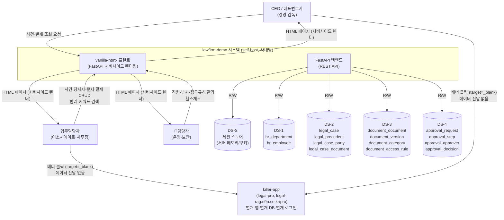

**시스템 경계 원칙**

| 항목 | lawfirm-demo | legal-pro (killer-app) |
|---|---|---|
| 배포 서버 | 사내망 self-host | 별개 서버 (legal-rag.n9n.co.kr) |
| DB | 별개 PostgreSQL (lawfirm_demo) | 별개 PostgreSQL (legal_rag) |
| 인증 | 세션 쿠키 (demo/demo) | JWT 변호사 계정 |
| 데이터 공유 | 없음 | 없음 |
| 연결 방식 | 진입 링크 target=_blank (새 탭) | — |

---

## 2. Level 1 DFD — P1: 인증·세션 관리

**대응 기능**: D1 §3 모듈 A (A-01~A-04), D2 §2 공통 진입 플로우

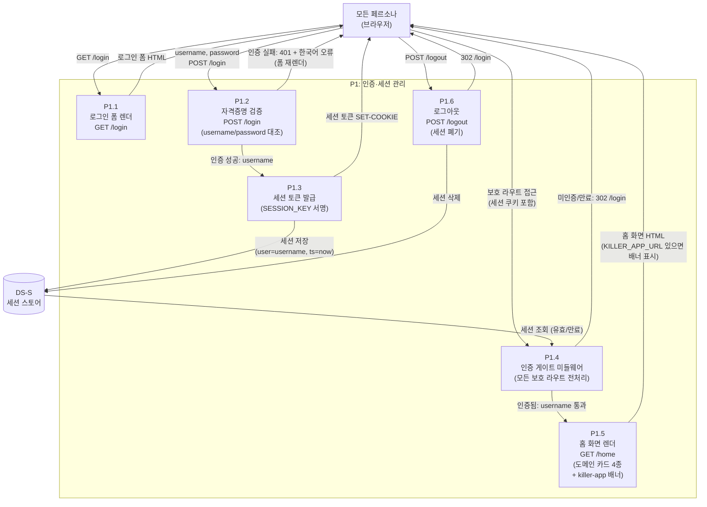

**데이터 항목**

| 흐름 | 데이터 | 형식 |
|---|---|---|
| USER → P1.2 | username, password | HTTP POST form |
| P1.3 → DS-S | 세션 키=값 (username, timestamp) | 서버 메모리 또는 암호화 쿠키 |
| P1.4 → DS-S | 세션 조회 (쿠키 token) | 키 조회 |
| DS-S → P1.4 | 세션 유효 여부 + username | Bool + str |

---

## 3. Level 1 DFD — P2: 사건 관리 (legal_case)

**대응 기능**: D1 §3 모듈 B-1 (B-01~B-04), D2 §3 시나리오 1 (사건 등록 단계)

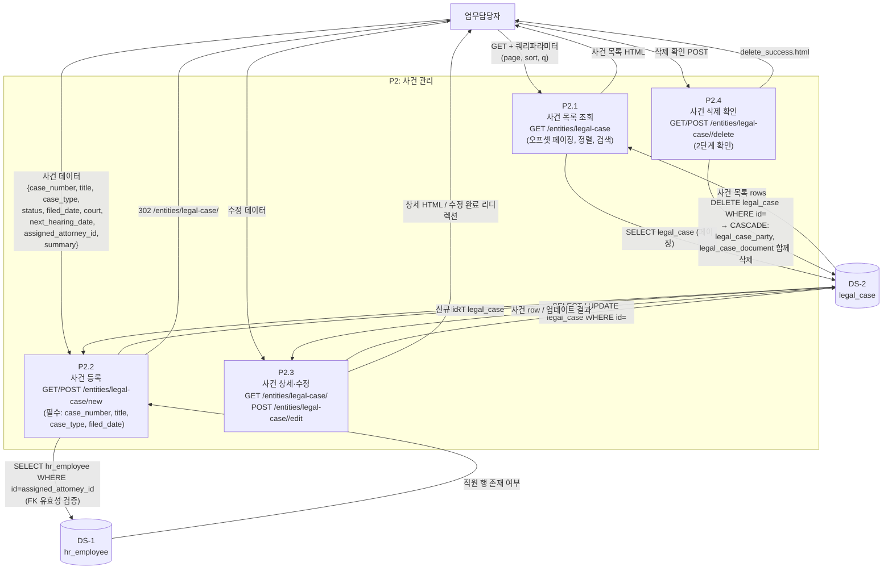

---

## 4. Level 1 DFD — P3: 판례 관리 (legal_precedent)

**대응 기능**: D1 §3 모듈 B-2 (B-05~B-09)

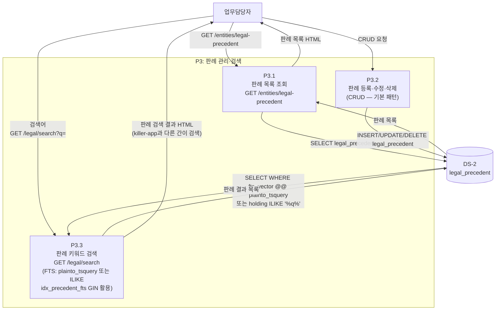

**주의**: `/legal/search` 는 lawfirm-demo 자체의 간이 키워드 검색(FTS)이다. legal-pro의 RAG 하이브리드 검색(ANN+FTS+RRF)과 다른 별개 기능이다.

---

## 5. Level 1 DFD — P4: 당사자 관리 (legal_case_party)

**대응 기능**: D1 §3 모듈 B-3 (B-10~B-13), D2 §3 시나리오 1 (당사자 추가 단계)

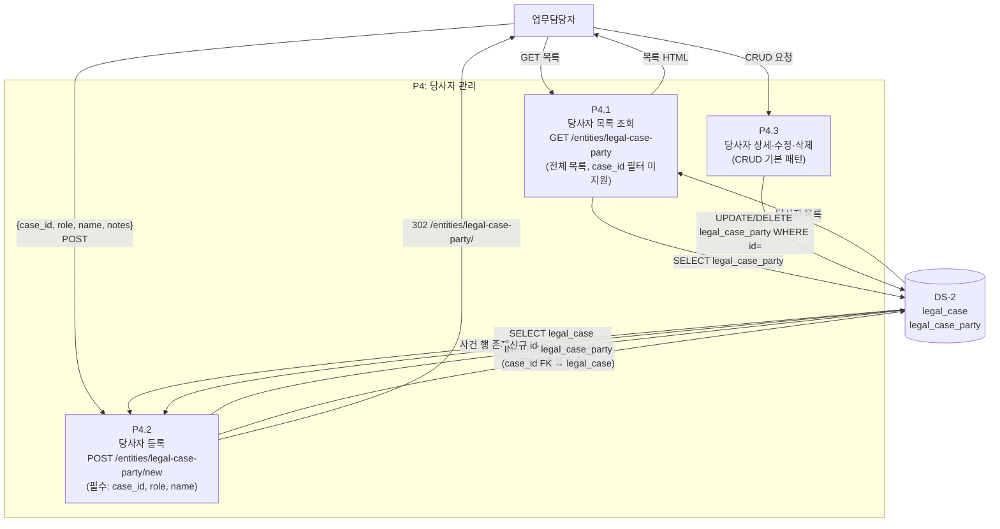

---

## 6. Level 1 DFD — P5: 사건문서 관리 (legal_case_document)

**대응 기능**: D1 §3 모듈 B-4 (B-14~B-17), D2 §3 시나리오 1 (문서 첨부 단계)

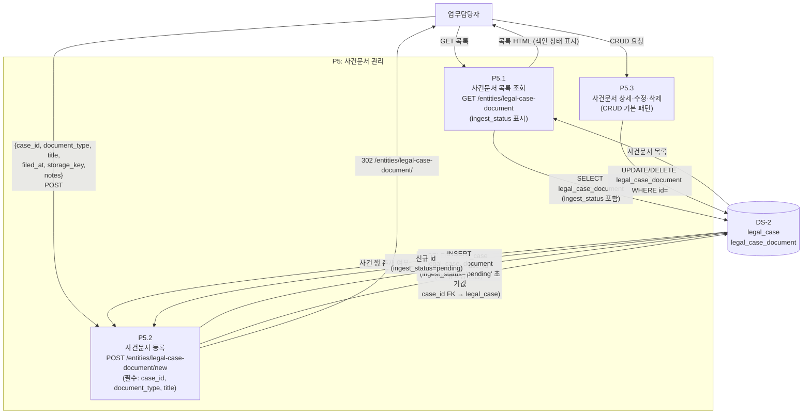

**흐름 메모**: 사건문서 등록 시 `ingest_status`는 항상 'pending'으로 초기화된다. 실제 텍스트 추출 및 색인은 외부 파이프라인(setup_lawfirm.py 또는 별도 ingest 프로세스)이 담당하며 lawfirm-demo UI의 범위 밖이다. 색인 완료 후 status가 'done'으로 갱신된다.

---

## 7. Level 1 DFD — P6: 인사 관리 (hr)

**대응 기능**: D1 §3 모듈 C (C-01~C-08)

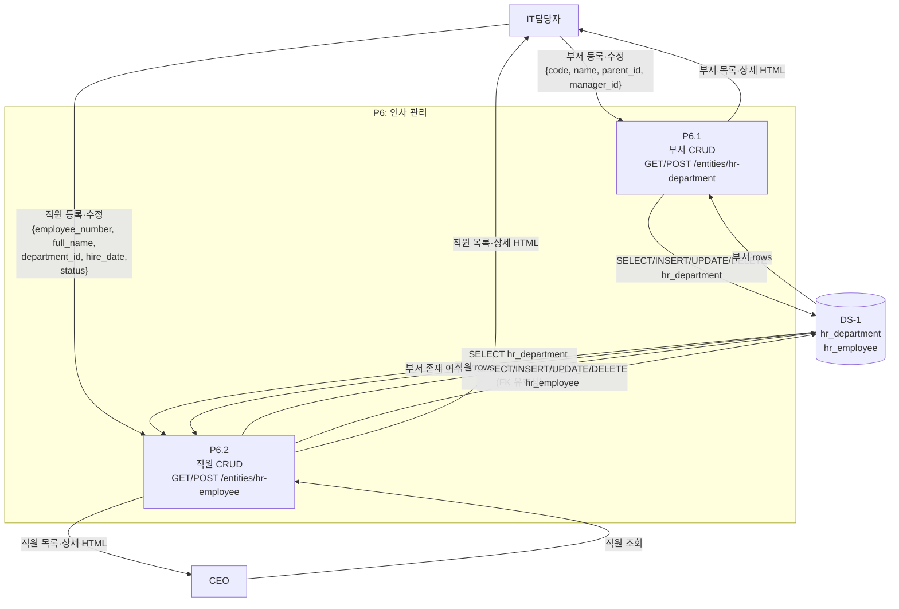

---

## 8. Level 1 DFD — P7: 문서관리 (document)

**대응 기능**: D1 §3 모듈 D (D-01~D-16), D2 §6 시나리오 4

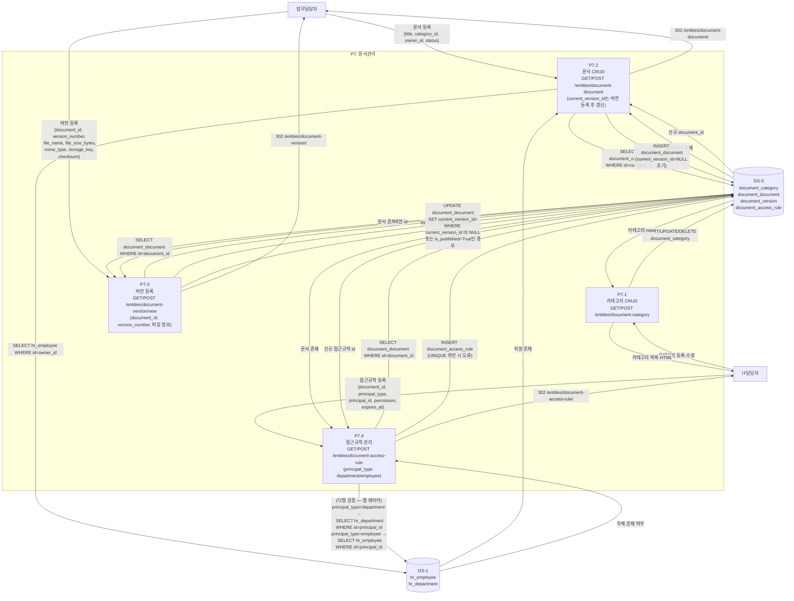

---

## 9. Level 1 DFD — P8: 전자결재 (approval)

**대응 기능**: D1 §3 모듈 E (E-01~E-16), D2 §5 시나리오 3 (결재 상신→승인)

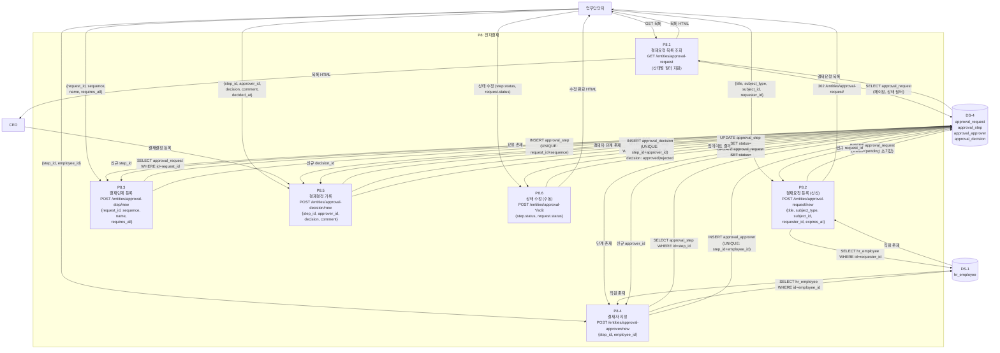

**결재 상태 전이 규칙** (앱 레이어 적용):

| 전이 | 조건 | 다음 상태 |
|---|---|---|
| approval_request: pending → in-progress | 1단계 승인 완료 | in-progress |
| approval_request: in-progress → approved | 마지막 단계 승인 완료 | approved |
| approval_request: in-progress → rejected | 임의 단계 반려 결정 | rejected |
| approval_step: pending → active | 이전 단계 완료 또는 첫 단계 | active |
| approval_step: active → approved | decision=approved (requires_all=true면 전원 승인) | approved |
| approval_step: active → rejected | decision=rejected 1건이라도 | rejected |

**현재 구현 한계**: 상태 전이는 업무담당자가 `approval-step` 및 `approval-request` 를 수동으로 수정하는 방식이다. 자동 전이 트리거(DB trigger 또는 백엔드 로직)는 미구현. Q-1(결재자 전용 처리 화면) 확정 후 자동화 여부 결정.

---

## 10. Level 2 상세 — 사건 등록 → 당사자 → 문서 흐름 (D2 시나리오 1)

**트리거**: 업무담당자가 신규 수임 사건을 시스템에 등록하고 당사자·문서를 연결.
**시드 기준**: C5 "업무상 횡령 고소 대응 사건" 등록 흐름.

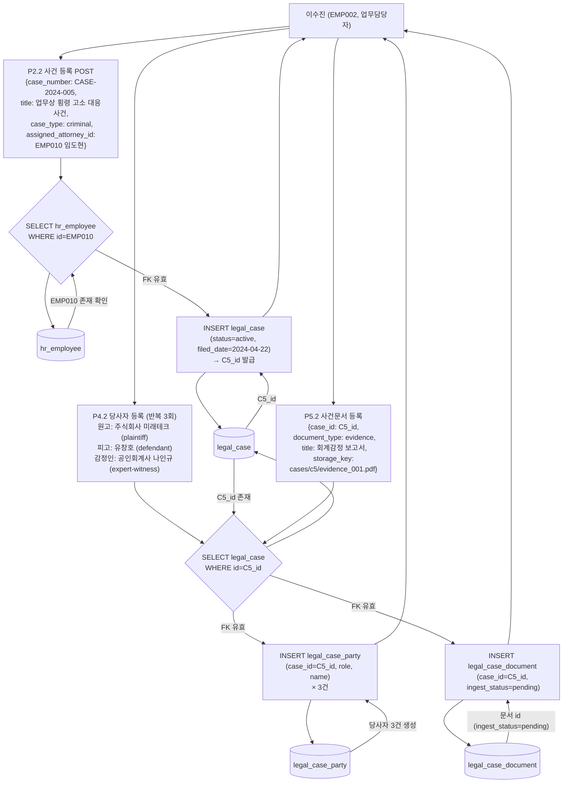

**무결성 체크포인트**:
1. `assigned_attorney_id` → `hr_employee` FK ON DELETE RESTRICT — 직원 삭제 시 사건이 있으면 차단
2. `case_id` → `legal_case` FK ON DELETE CASCADE — 사건 삭제 시 당사자·사건문서 함께 삭제
3. `ingest_status` 초기값 = 'pending' — 등록 즉시 색인 대기 상태

---

## 11. Level 2 상세 — 결재 다단계 승인 흐름 (D2 시나리오 3)

**트리거**: 강민서(EMP007)가 AQ5 "SaaS 계약서 외부 발송 승인" 상신.
**시드 기준**: AQ5 1단계 완료(강민서 승인), 2단계 대기(김대호 미응답) 상태.

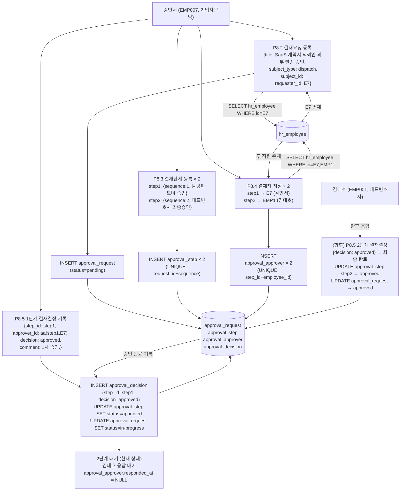

**상태 전이 검증 포인트**:
- AQ5 시드: `status=in-progress`, step1 `status=approved`, step2 `status=active`
- step2의 `approval_approver.notified_at` = 2026-06-21, `responded_at` = NULL (미응답)
- 최종 승인 시: step2 → approved, request → approved

---

## 12. killer-app 크로스앱 데이터 경계 (D2 §9)

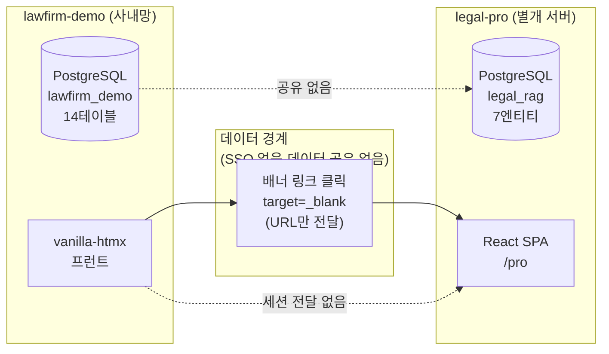

**정직 표기**:
- lawfirm-demo 와 legal-pro 는 **완전히 독립적인 데이터스토어**를 가진다.
- 배너 클릭은 URL 이동만 발생한다. 세션 토큰·사건 데이터·사용자 정보는 전달되지 않는다.
- legal-pro 접속 후 변호사 계정으로 별도 로그인이 필요하다.
- 이 경계를 넘는 데이터 흐름은 현재 인도 범위 내에 존재하지 않는다.

---

## 13. 프로세스 목록 (P1~P8)

| 번호 | 프로세스 | D1 기능 | D2 시나리오 | 주 데이터스토어 | 핵심 변환 |
|---|---|---|---|---|---|
| P1 | 인증·세션 관리 | A-01~A-04 | 공통 진입 | DS-S (세션) | 자격증명 검증 → 세션 토큰 발급/폐기 |
| P2 | 사건 관리 | B-01~B-04 | 시나리오 1, 2 | DS-2 (legal_case) | 사건 CRUD, FK 유효성(assigned_attorney_id) |
| P3 | 판례 관리·검색 | B-05~B-09 | (법무 검색) | DS-2 (legal_precedent) | 판례 CRUD + FTS 검색 |
| P4 | 당사자 관리 | B-10~B-13 | 시나리오 1 | DS-2 (legal_case_party) | 당사자 CRUD, case_id FK 검증 |
| P5 | 사건문서 관리 | B-14~B-17 | 시나리오 1 | DS-2 (legal_case_document) | 문서 CRUD, ingest_status 초기화 |
| P6 | 인사 관리 | C-01~C-08 | 시나리오 4 | DS-1 (hr_*) | 직원·부서 CRUD, department_id FK |
| P7 | 문서관리 | D-01~D-16 | 시나리오 4 | DS-3 (document_*) | 문서·버전·접근규칙 CRUD, 다형 principal 검증 |
| P8 | 전자결재 | E-01~E-16 | 시나리오 3 | DS-4 (approval_*) | 결재 상신→단계→결재자→결정, 상태 전이 |

---

## 14. DFD 검증 포인트 (QA 체크 기준)

> 이 목록이 QA의 "데이터가 프로세스에 따라 올바르게 흐르는가" 검증 입력이다.
> 각 포인트는 테스트 케이스 1건에 대응한다.

### P1 — 인증

| VP-ID | 검증 항목 | 기대 결과 |
|---|---|---|
| VP-P1-01 | 잘못된 password POST /login | HTTP 401 + 한국어 오류 메시지 (폼 재렌더) |
| VP-P1-02 | 세션 쿠키 없이 보호 라우트 접근 | 302 /login 리디렉션 |
| VP-P1-03 | 만료된 세션으로 보호 라우트 접근 | 302 /login 리디렉션 |
| VP-P1-04 | POST /logout 후 세션 쿠키로 재접근 | 302 /login (세션 폐기 확인) |
| VP-P1-05 | 로그인 성공 후 홈 화면 렌더 | 도메인 카드 4종 표시. KILLER_APP_URL 설정 시 배너 표시 |

### P2 — 사건 관리

| VP-ID | 검증 항목 | 기대 결과 |
|---|---|---|
| VP-P2-01 | 사건 등록 시 assigned_attorney_id가 hr_employee에 없는 UUID | INSERT 실패 (FK 위반 또는 앱 레이어 404) |
| VP-P2-02 | case_type에 허용되지 않은 값 ('other' 등) | INSERT 실패 (CHECK 제약 위반) |
| VP-P2-03 | status에 허용되지 않은 값 | INSERT 실패 (CHECK 제약 위반) |
| VP-P2-04 | 동일 case_number 중복 등록 | INSERT 실패 (UK 위반) |
| VP-P2-05 | 사건 삭제 시 linked legal_case_party 함께 삭제 | CASCADE 확인: party 건수 감소 |
| VP-P2-06 | 사건 삭제 시 linked legal_case_document 함께 삭제 | CASCADE 확인: doc 건수 감소 |

### P3 — 판례 관리·검색

| VP-ID | 검증 항목 | 기대 결과 |
|---|---|---|
| VP-P3-01 | 동일 citation 중복 등록 | INSERT 실패 (UK 위반) |
| VP-P3-02 | /legal/search?q=이혼 키워드 검색 | legal_precedent 중 holding 또는 keywords에 "이혼" 포함 행 반환 |
| VP-P3-03 | /legal/search?q=존재하지않는키워드 | 0건 결과 HTML 렌더 (에러 아님) |

### P4 — 당사자 관리

| VP-ID | 검증 항목 | 기대 결과 |
|---|---|---|
| VP-P4-01 | 당사자 등록 시 case_id가 legal_case에 없는 UUID | INSERT 실패 (FK 위반 또는 앱 레이어 404) |
| VP-P4-02 | role에 허용되지 않은 값 ('other' 등) | INSERT 실패 (CHECK 제약 위반) |
| VP-P4-03 | 동일 사건에 동일 역할 2명 등록 (예: C7 피고 2명) | INSERT 성공 (역할별 복수 허용, UNIQUE 없음) |

### P5 — 사건문서 관리

| VP-ID | 검증 항목 | 기대 결과 |
|---|---|---|
| VP-P5-01 | 사건문서 등록 시 case_id FK 미존재 | INSERT 실패 (FK 위반) |
| VP-P5-02 | 사건문서 등록 후 ingest_status | 'pending' 으로 초기화됨 |
| VP-P5-03 | document_type에 허용되지 않은 값 | INSERT 실패 (CHECK 제약) |
| VP-P5-04 | ingest_status를 'done'으로 수정 후 다시 'pending'으로 수정 | UPDATE 성공 (상태 역전 허용 여부 앱 레이어 정책 확인 필요) |

### P6 — 인사 관리

| VP-ID | 검증 항목 | 기대 결과 |
|---|---|---|
| VP-P6-01 | 직원 등록 시 department_id FK 미존재 | INSERT 실패 (FK ON DELETE RESTRICT) |
| VP-P6-02 | 직원 삭제 시 해당 직원이 assigned_attorney인 사건이 존재 | DELETE 실패 (FK ON DELETE RESTRICT — legal_case 보호) |
| VP-P6-03 | 직원 삭제 시 document_document.owner_id 참조 존재 | DELETE 실패 (FK ON DELETE RESTRICT) |
| VP-P6-04 | status에 허용되지 않은 값 | INSERT 실패 (CHECK 제약) |
| VP-P6-05 | employee_number 중복 등록 | INSERT 실패 (UK 위반) |

### P7 — 문서관리

| VP-ID | 검증 항목 | 기대 결과 |
|---|---|---|
| VP-P7-01 | 문서 등록 시 category_id FK 미존재 | INSERT 실패 (FK ON DELETE RESTRICT) |
| VP-P7-02 | 문서 등록 시 owner_id(hr_employee) FK 미존재 | INSERT 실패 (FK ON DELETE RESTRICT) |
| VP-P7-03 | 동일 문서에 같은 version_number 중복 등록 | INSERT 실패 (UNIQUE: document_id+version_number) |
| VP-P7-04 | 접근규칙 등록 시 동일 (document_id, principal_type, principal_id) 중복 | INSERT 실패 (UNIQUE 제약) |
| VP-P7-05 | 접근규칙 permission에 허용되지 않은 값 | INSERT 실패 (CHECK 제약) |
| VP-P7-06 | 문서 삭제 시 linked document_access_rule 함께 삭제 | CASCADE 확인 |
| VP-P7-07 | 문서 삭제 시 linked document_version 함께 삭제 | CASCADE 확인 |
| VP-P7-08 | principal_type=department + principal_id가 hr_department에 없는 UUID | 앱 레이어 검증 실패 (DB FK 없음 — 앱 레이어 책임) |

### P8 — 전자결재

| VP-ID | 검증 항목 | 기대 결과 |
|---|---|---|
| VP-P8-01 | 결재요청 등록 시 requester_id FK 미존재 | INSERT 실패 (FK ON DELETE RESTRICT) |
| VP-P8-02 | approval_request.status에 허용되지 않은 값 | INSERT 실패 (CHECK 제약) |
| VP-P8-03 | 동일 request에 동일 sequence 중복 단계 등록 | INSERT 실패 (UNIQUE: request_id+sequence) |
| VP-P8-04 | 동일 step에 동일 employee 중복 결재자 등록 | INSERT 실패 (UNIQUE: step_id+employee_id) |
| VP-P8-05 | 결재결정 decision에 'pending' 값 | INSERT 실패 (CHECK: approved|rejected만 허용) |
| VP-P8-06 | 동일 (step_id, approver_id) 결재결정 중복 | INSERT 실패 (UNIQUE 제약) |
| VP-P8-07 | 결재요청 삭제 시 linked approval_step 함께 삭제 | CASCADE: step → approver → 삭제 연쇄 |
| VP-P8-08 | 결재요청 status 전이: pending → in-progress | 첫 단계 승인 후 status 수정 확인 |
| VP-P8-09 | 결재요청 status 전이: in-progress → approved | 마지막 단계 승인 후 status 수정 확인 |
| VP-P8-10 | AQ5 시드 검증: step1=approved, step2=active, request=in-progress | 시드 로드 후 상태 일치 확인 |

**검증 포인트 계수**: 총 **34개**
- P1 인증: 5개
- P2 사건: 6개
- P3 판례: 3개
- P4 당사자: 3개
- P5 사건문서: 4개
- P6 인사: 5개
- P7 문서관리: 8개
- P8 전자결재: 10개

---

## 15. QA 게이트 통과 기준 (Merge BLOCK 조건)

| 조건 ID | BLOCK 기준 |
|---|---|
| **BLK-D5-1** | VP-P1-01~VP-P1-02 (로그인 실패·미인증 접근) 1개 이상 FAIL |
| **BLK-D5-2** | VP-P2-01 (assigned_attorney_id FK 위반) FAIL — 사건-직원 관계 훼손 |
| **BLK-D5-3** | VP-P2-05~VP-P2-06 (사건 삭제 CASCADE) FAIL — 당사자·문서 고아 레코드 발생 |
| **BLK-D5-4** | VP-P5-02 (ingest_status 초기값 pending) FAIL — 색인 파이프라인 기준 오염 |
| **BLK-D5-5** | VP-P6-02 (담당 변호사 직원 삭제 RESTRICT) FAIL — 사건 데이터 정합 훼손 |
| **BLK-D5-6** | VP-P7-04 (접근규칙 UNIQUE 중복) FAIL — 권한 중복 허용은 보안 결함 |
| **BLK-D5-7** | VP-P8-06 (결재결정 UNIQUE 중복) FAIL — 동일 결재자 이중결정 허용 불가 |
| **BLK-D5-8** | VP-P8-07 (결재요청 삭제 CASCADE) FAIL — 고아 단계·결재자 발생 |

---

## 부록 A — D1 기능 ↔ DFD 프로세스 대응표

| D1 모듈 | 기능 ID | DFD 프로세스 | 데이터스토어 |
|---|---|---|---|
| A (인증) | A-01~A-04 | P1 | DS-S |
| B-1 (사건) | B-01~B-04 | P2 | DS-2 (legal_case) |
| B-2 (판례) | B-05~B-09 | P3 | DS-2 (legal_precedent) |
| B-3 (당사자) | B-10~B-13 | P4 | DS-2 (legal_case_party) |
| B-4 (사건문서) | B-14~B-17 | P5 | DS-2 (legal_case_document) |
| C-1 (직원) | C-01~C-04 | P6 | DS-1 (hr_employee) |
| C-2 (부서) | C-05~C-08 | P6 | DS-1 (hr_department) |
| D-1 (문서) | D-01~D-04 | P7 | DS-3 (document_document) |
| D-2 (버전) | D-05~D-08 | P7 | DS-3 (document_version) |
| D-3 (카테고리) | D-09~D-12 | P7 | DS-3 (document_category) |
| D-4 (접근규칙) | D-13~D-16 | P7 | DS-3 (document_access_rule) |
| E-1 (결재요청) | E-01~E-04 | P8 | DS-4 (approval_request) |
| E-2 (결재단계) | E-05~E-08 | P8 | DS-4 (approval_step) |
| E-3 (결재자) | E-09~E-12 | P8 | DS-4 (approval_approver) |
| E-4 (결재결정) | E-13~E-16 | P8 | DS-4 (approval_decision) |
| F (killer-app) | F-01~F-03 | 크로스앱 경계 §12 | 해당 없음 (데이터 공유 없음) |
