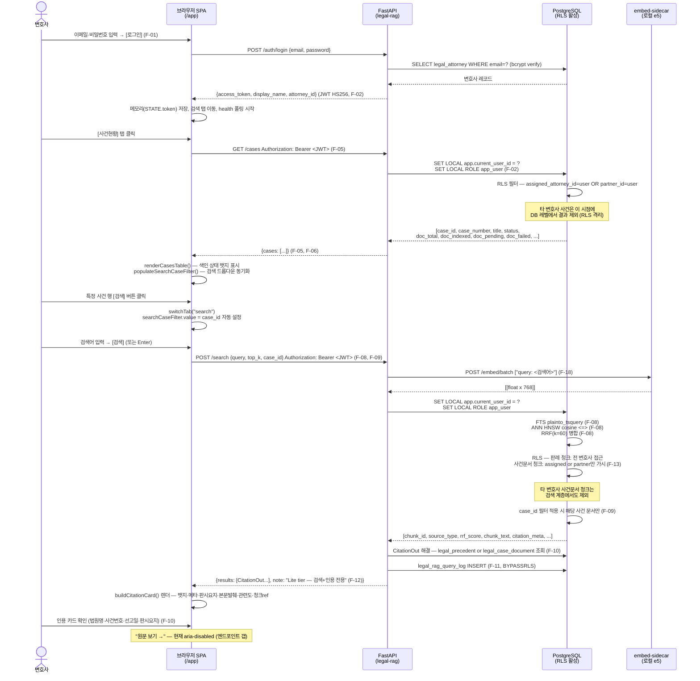
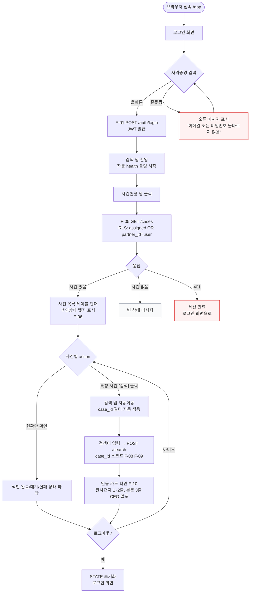
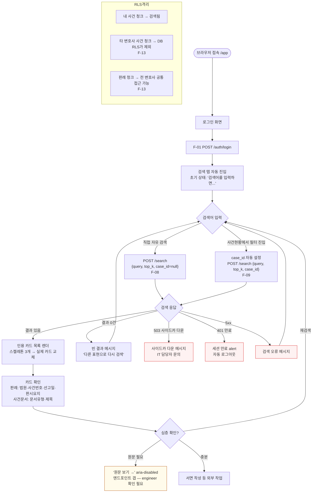
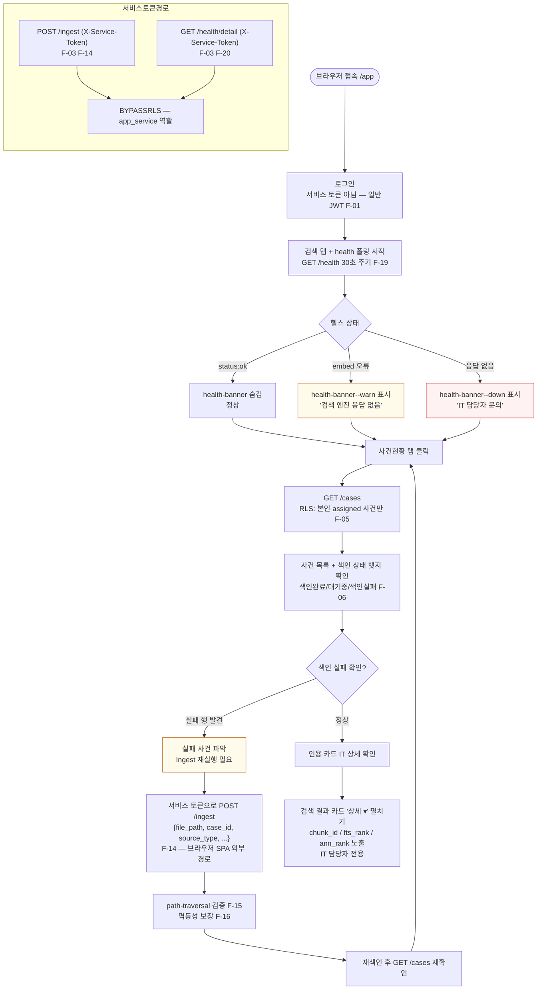

# D2 — 유저플로우 : 법무 통합 제품 (사건관리 + 판례 RAG 검색)

> 문서 번호: D2
> owner: PM · CDO
> 상태: DRAFT v0.1 (2026-06-20)
> 연관 anchor: `docs/projects/legal/README.md`
> 상위 입력: D1 기능명세서 (`docs/projects/legal/D1-functional-spec.md`)
> 다운스트림: D3(와이어프레임) — §6 screen inventory 참조

---

## 0. 읽기 전 주의

- **Q-1 미확정**: 사건 CRUD(생성·수정) 가 이번 인도 범위인지 CEO 에게 확인되지 않음.
  사건 관련 쓰기 화면은 플로우 내 **점선 노드**(`[[ ]]` 표기)로 표현한다. 현재 가정은 **조회 전용**.
- `GET /cases` 에 대한 사건 상세(drill-down) 엔드포인트가 현재 API 계약에 없다.
  해당 단계는 "**엔드포인트 갭 — engineer 확인 필요**" 주석으로 표기한다.
- 이 문서의 모든 플로우는 라이브 SPA(`services/legal-rag/web/app.js`) 의 실동작을 기반으로 한다.

---

## 1. 페르소나 요약

| 페르소나 | 역할 | 주 진입 화면 | 핵심 목표 |
|---|---|---|---|
| CEO (대표·파트너 변호사) | 경영·감독 | 사건현황 탭 | 담당 사건 전체 파악, RLS 격리 확인 |
| 업무담당자 (어쏘·사무직) | 실무 검색 | 검색 탭 | 유사 판례 탐색, 서면 근거 수집 |
| IT 담당자 | 운영·보안 | 사건현황 탭 + health 배너 | 색인 상태·서비스 헬스 모니터링 |

---

## 2. 핵심 통합 시나리오 — 로그인 → 사건현황 → 사건 컨텍스트 판례 검색 → 인용 확인

> **1앱 단일 내러티브**: 사건 화면에서 [검색] 버튼 클릭 → 검색 탭이 해당 사건 필터를 자동 적용한 채 열린다.

---

## 3. CEO 플로우

**목표**: 담당 전체 사건 현황 파악, RLS 격리가 실제로 작동함을 확인.
CEO(파트너)는 직접 검색보다 사건 현황 조회가 주 업무.

**RLS 격리 체감 지점**: CEO(파트너) 는 `partner_id` 매핑 덕에 **전 사건이 목록에 나타남**.
반면 일반 어쏘 변호사가 같은 화면을 보면 자신의 `assigned_attorney_id` 사건만 보임.
이 차이가 사용자 경험에서 유일하게 RLS 격리가 보이는 지점이다.

---

## 4. 업무담당자 플로우

**목표**: 특정 논점 판례 탐색 → 서면 작성 근거 수집 → 반복 검색.

**RLS 격리 체감 지점**: 사건 스코프 검색(F-09)에서 `case_id` 를 지정해도,
다른 변호사의 사건 ID 를 URL/파라미터로 직접 넘기면 DB RLS 가 청크를 반환하지 않는다.
사용자가 이를 직접 알아채기 어렵지만, **보안 보장이 UI 우회 불가 수준임**을 D5 DFD 에서 명시한다.

---

## 5. IT 담당자 플로우

**목표**: 색인 상태 확인, 서비스 헬스 모니터링, 인제스트 실행.

**IT 담당자 전용 UI 요소**:
- `.health-banner` — 로그인 직후부터 30초 주기 `/health` 폴링 (모든 페르소나)
- `.details-toggle` (`
/
`) — 인용 카드 내 chunk_id / fts_rank / ann_rank (DOM 에 항상 존재, IT가 펼침)
- `/ingest` 는 브라우저 SPA 바깥의 서비스 토큰 경로 (CLI·스크립트 실행)

---

## 6. 예외·에러 플로우 요약

| 상황 | 트리거 | 화면 처리 | F-ID |
|---|---|---|---|
| 인증 실패 (401 로그인) | 잘못된 이메일/비밀번호 | `.login-card__alert` — "이메일 또는 비밀번호가 올바르지 않습니다." | F-01 |
| rate-limit (429) | IP당 5 req/min 초과 | 서버 응답 → 동일 alert 영역 ("서버에 연결할 수 없습니다. IT 담당자에게 문의하세요.") | F-04 |
| 서버 연결 불가 (로그인 시) | fetch 예외 또는 5xx | `.login-card__alert` — "서버에 연결할 수 없습니다. IT 담당자에게 문의하세요." | — |
| 토큰 만료 (검색 중 401) | JWT 만료 후 /search 호출 | 500ms 후 alert → 자동 로그아웃 → 로그인 화면 | F-02 |
| 토큰 만료 (사건현황 401) | /cases 호출 시 | casesError 표시 — "세션이 만료되었습니다. 다시 로그인하세요." | F-02 |
| 검색 0건 | top_k 만족 결과 없음 | `.results--empty` — "입력하신 내용과 일치하는 문서가 없습니다." | F-08 |
| 사이드카 다운 (503) | /search 503 응답 | `.results--sidecar-down` — "IT 담당자에게 문의하세요." | F-17 |
| 검색 서버 오류 (5xx) | /search 기타 오류 | `.results--error` — "검색 중 오류가 발생했습니다." | — |
| 헬스 이상 (embed) | /health embed_sidecar=error | `.health-banner--warn` — "서비스 저하 — 검색 엔진 응답 없음" | F-19 F-20 |
| 헬스 다운 | /health fetch 실패 | `.health-banner--down` — "서비스 상태를 확인할 수 없습니다." | F-19 |
| 사건 목록 로드 실패 | /cases 5xx | casesError — "사건 목록을 불러오지 못했습니다." | F-05 |
| 권한 없는 사건 문서 검색 | 타 변호사 case_id로 /search | DB RLS 가 청크 제외 → 결과 0건 또는 필터 후 건수 감소 | F-13 |

---

## 7. RLS 격리 — 사용자 경험 가시 지점 정리

RLS 는 DB 레벨에서 투명하게 작동한다. 사용자가 직접 "격리"를 인식하는 지점:

| 시나리오 | 페르소나 | 체감 방식 |
|---|---|---|
| 사건현황 목록 | CEO(파트너) vs 어쏘 | 파트너는 전 사건 노출. 어쏘는 본인 담당 사건만. 같은 화면 URL이지만 결과가 다름. |
| 검색 case_id 스코프 | 업무담당자 | 타 변호사 case_id 지정 시 → 사건문서 청크 0건 (판례 청크는 공통 가시). |
| 검색 case_id=null (전체) | 업무담당자 | 판례 청크는 전체 나옴. 사건문서 청크는 자기 담당 사건만 섞임. |
| 검색 결과 건수 차이 | 업무담당자 | 동일 쿼리여도 담당 사건 수·문서 수에 따라 결과 건수가 변호사마다 다름. |

---

## 8. D3 와이어프레임 — screen inventory

D3 CDO 가 그려야 할 화면 목록 (이 플로우에서 도출):

| # | 화면 이름 | 상태 변형 포함 | 연결 F-ID |
|---|---|---|---|
| S-01 | 로그인 | 기본 / 로딩 / 에러(인증실패) / 에러(서버불가) | F-01 F-04 |
| S-02 | 앱 헤더 + 탭 바 | health-banner 3종(없음/warn/down) | F-02 F-19 |
| S-03 | 검색 탭 — 초기 상태 | 검색 전 안내 메시지 | F-08 |
| S-04 | 검색 탭 — 로딩 | 스켈레톤 카드 3개 | F-08 |
| S-05 | 검색 탭 — 결과 있음 | 판례 카드 + 사건문서 카드 혼합 | F-08 F-09 F-10 F-12 |
| S-06 | 검색 탭 — 결과 없음 | 빈 결과 메시지 | F-08 |
| S-07 | 검색 탭 — 에러 (사이드카 다운) | sidecar-down 메시지 | F-17 |
| S-08 | 검색 탭 — 에러 (일반 오류) | 검색 오류 메시지 | — |
| S-09 | 사건현황 탭 — 로딩 | 로딩 인디케이터 | F-05 |
| S-10 | 사건현황 탭 — 정상 (혼합 상태) | 색인완료/대기/실패 행 혼합 | F-05 F-06 |
| S-11 | 사건현황 탭 — 빈 사건 목록 | 빈 상태 메시지 | F-05 |
| S-12 | 사건현황 탭 — 로드 실패 | 에러 메시지 | F-05 |
| S-13 | 인용 카드 — 판례 타입 | 금색 뱃지 + 판시요지 + 발췌 | F-10 F-12 |
| S-14 | 인용 카드 — 사건문서 타입 | 네이비 뱃지 + 문서유형 + 발췌 | F-10 F-12 |
| S-15 | 인용 카드 IT 상세 펼침 | details/summary open 상태 | F-11 |
| [[S-16]] | 사건 상세 drill-down | **미확정 — 엔드포인트 갭** | GET /cases/{id} 없음 |
| [[S-17]] | 사건 생성/수정 | **미확정 — Q-1 CEO 확인 필요** | POST /cases 없음 |

> `[[ ]]` 는 Q-1 미확정 화면. D3 착수 전 CEO 에게 Q-1 답변 확보 필요.

---

## 9. 엔드포인트·스펙 갭 (발견 목록)

| # | 갭 유형 | 내용 | 영향 | 권장 처리 |
|---|---|---|---|---|
| G-1 | 엔드포인트 없음 | `GET /cases/{case_id}` (사건 상세 drill-down) 미정의. 목록에서 사건명 클릭 시 이동할 대상 없음. | S-16 화면 구현 불가 | engineer 에게 API 추가 여부 확인 (Q-1 연동) |
| G-2 | 엔드포인트 없음 | `POST /cases`, `PATCH /cases/{id}` (사건 CRUD). 사건 생성·수정 화면 구현 불가. | S-17 화면 구현 불가 | Q-1 CEO 답변 후 범위 확정 |
| G-3 | 원문 서빙 없음 | 인용 카드 "원문 보기 →" 의 대상 엔드포인트(파일 다운로드 또는 미리보기) 미정의. 현재 `aria-disabled`. | 업무담당자 원문 접근 불가 | 별도 파일 서빙 엔드포인트 설계 검토 (scope 확인) |
| G-4 | 검색 페이지네이션 없음 | `POST /search` 응답에 cursor/offset 없음. `top_k` 파라미터로 단일 페이지. 결과가 20건 이상 필요한 경우 미지원. | 대형 사건 검색 시 UX 저하 | MVP 수용. 추후 cursor 추가 시 UI 확장 |
| G-5 | 사건 삭제 API 없음 | `DELETE /cases/{id}` 정책 없음 (F-07 법적 감사 요건). IT 관리자 화면에서 삭제 UI 불필요함을 명시. | 의도된 갭 (설계 결정) | D3 에서 삭제 버튼 그리지 않도록 CDO 에 전달 |
| G-6 | 로그인 rate-limit UI 미지원 | 429 응답 처리 코드가 `app.js` 에 명시적으로 없음. 5xx 경로로 fallthrough. | IT 담당자가 rate-limit 피드백 못 받음 | app.js 에 429 분기 처리 추가 권장 (engineer) |

---

## 부록 A — 기능 ID ↔ 플로우 단계 추적성

| F-ID | 기능명 | 등장 플로우 | 플로우 내 단계 |
|---|---|---|---|
| F-01 | 변호사 로그인 | 전 페르소나 | 로그인 화면 → POST /auth/login |
| F-02 | JWT 검증 | 전 페르소나 | 보호 엔드포인트 호출마다 미들웨어 |
| F-03 | 서비스 토큰 인증 | IT 담당자 | /ingest · /health/detail (SPA 외부) |
| F-04 | 로그인 rate-limit | 전 페르소나 | Traefik 레이어 (로그인 폼 제출) |
| F-05 | 담당 사건 목록 조회 | CEO · IT담당자 | 사건현황 탭 진입 → GET /cases |
| F-06 | 사건 상태 표시 | CEO · IT담당자 | 사건현황 테이블 내 뱃지 |
| F-07 | 사건 삭제 없음 | (UI 없음) | 삭제 버튼 미존재 — D3 주의 |
| F-08 | 하이브리드 검색 | 전 페르소나 | 검색 탭 → POST /search |
| F-09 | 사건 스코프 검색 | 업무담당자 · CEO | 사건현황 [검색] 클릭 → case_id 필터 자동 적용 |
| F-10 | 인용 출처 해결 | 전 페르소나 | 검색 결과 인용 카드 메타 표시 |
| F-11 | 쿼리 로그 기록 | 시스템 (내부) | /search 응답 후 자동 기록 |
| F-12 | LLM 생성 없음 | 전 페르소나 | SearchResponse.note 표시 + 생성형 영역 없음 |
| F-13 | 검색 청크 RLS 격리 | 업무담당자 (RLS 체감) | POST /search — DB RLS 필터 |
| F-14 | 파일 인제스트 | IT 담당자 | POST /ingest (SPA 외부) |
| F-15 | path-traversal 방어 | IT 담당자 | /ingest 검증 레이어 |
| F-16 | 인제스트 멱등성 | IT 담당자 | /ingest 재실행 안전 |
| F-17 | 임베딩 사이드카 격리 | IT 담당자 | 503 → sidecar-down 상태 |
| F-18 | e5 비대칭 프리픽스 | 시스템 (내부) | embed sidecar 호출 규약 |
| F-19 | Shallow 헬스체크 | IT 담당자 · 전 페르소나 | GET /health 30초 폴링 |
| F-20 | Deep 헬스체크 | IT 담당자 | GET /health/detail (X-Service-Token) |
| F-21 | SPA 정적 파일 서빙 | 전 페르소나 | GET /app/* 진입점 |
| F-22 | prod API 문서 비활성 | IT 담당자 | /docs · /redoc 차단 (prod 환경) |
