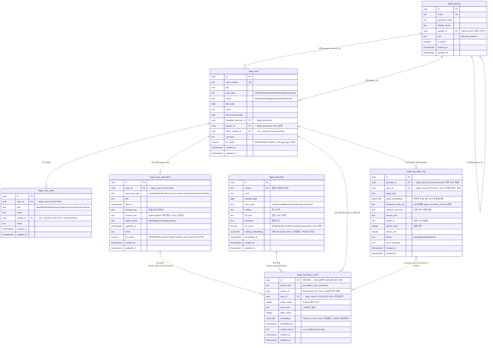

# D4 ERD — 법무 통합 제품

> `docs/projects/legal/README.md §3` D4 슬롯 산출물.
> Growth-24 base 4엔티티 + Growth-48 RAG augment 4엔티티 = **총 8엔티티**.
> 기존 초안 `presets/ddl/augments/legal/erd_legal_rag.md` 를 확장·정식화.

## 1. 전체 ERD (Mermaid erDiagram)



---

## 2. 엔티티 상세 — PK/FK · 카디널리티 · RLS

### 2-1. legal_attorney (변호사 계정)

| 항목 | 내용 |
|---|---|
| PK | `id` (UUID) |
| UK | `email` |
| FK | `partner_id` → `legal_attorney.id` SELF-REF, ON DELETE SET NULL, DEFERRABLE INITIALLY DEFERRED |
| 카디널리티 | 자기참조 0..1:N (파트너 1명 : 어소시에이트 N명) |
| RLS | app_user SELECT: 본인(`id = current_user_id`) OR 소속 어소시에이트(`partner_id = current_user_id`). INSERT/UPDATE/DELETE: app_service 전용 (자가가입 금지) |
| 특이 | `password_hash` bcrypt $2b$ cost≥12. **app_user 에게 GRANT 없음** — 로그인은 app_service(BYPASSRLS) 단독. |

### 2-2. legal_case (사건) — base + augment 병합

| 항목 | 내용 |
|---|---|
| PK | `id` (UUID) |
| UK | `case_number` |
| FK | `assigned_attorney_id` → `legal_attorney.id` ON DELETE RESTRICT (Growth-48 augment 추가). `partner_id` → `legal_attorney.id` ON DELETE SET NULL. `client_contact_id` → crm_contact (cross-domain, 앱 레이어 적용) |
| 카디널리티 | attorney:cases = 1:N (담당), attorney:cases = 1:N (감독, nullable) |
| RLS (목록격리) | SELECT: `assigned_attorney_id = current_user_id` OR `partner_id = current_user_id`. INSERT: assigned 본인. UPDATE: assigned OR partner. DELETE 정책 없음(법적 감사 불변) |
| Augment 컬럼 | `partner_id` (02_legal_case_augment), `fts_vector` GENERATED ALWAYS (02). pg_bigm GIN 인덱스 |

### 2-3. legal_case_party (사건 당사자)

| 항목 | 내용 |
|---|---|
| PK | `id` (UUID) |
| FK | `case_id` → `legal_case.id` ON DELETE CASCADE. `contact_id` → crm_contact ON DELETE SET NULL (cross-domain) |
| 카디널리티 | case:parties = 1:N |
| RLS (PII 격리) | SELECT/INSERT/UPDATE: 부모 사건의 assigned_attorney OR partner 서브쿼리 조인. DELETE 정책 없음 |
| 특이 | PII(`name`) 포함. 역할별 복수 동일인 허용(동일 인물이 원고+증인 가능) |

### 2-4. legal_case_document (사건 서류)

| 항목 | 내용 |
|---|---|
| PK | `id` (UUID) |
| FK | `case_id` → `legal_case.id` ON DELETE CASCADE |
| 카디널리티 | case:documents = 1:N (append-only) |
| RLS (case-scoped) | SELECT/INSERT: 부모 사건 attorney/partner 서브쿼리. UPDATE/DELETE 정책 없음(감사 불변) |
| Augment 컬럼 | `content_text`, `ingest_status`, `ingested_at`, `fts_vector` GENERATED ALWAYS (04_case_document_augment) |
| 인덱스 | GIN(`fts_vector`), B-Tree(`case_id`, `document_type`, `ingest_status`) |

### 2-5. legal_precedent (판례)

| 항목 | 내용 |
|---|---|
| PK | `id` (UUID) |
| UK | `citation` |
| FK | 없음 (독립 지식 기반) |
| 카디널리티 | 독립; chunk와 1:N |
| RLS | SELECT: 전 app_user 허용 (firm-wide 공개 지식). INSERT/UPDATE/DELETE: app_service 전용 |
| Augment 컬럼 | `fts_vector` GENERATED ALWAYS, `holding_embedding` vector(768), `embedded_at` (03_precedent_augment) |
| 인덱스 | GIN(`fts_vector`), HNSW(cosine) on `holding_embedding` (m=16, ef_construction=64), pg_bigm GIN on `holding` |

### 2-6. legal_document_chunk (문서 청크 — RAG 핵심)

| 항목 | 내용 |
|---|---|
| PK | `id` (UUID) — **인용 앵커** |
| UK | `(source_id, source_type, chunk_index)` |
| FK | `case_id` → `legal_case.id` ON DELETE CASCADE (NULL=판례 청크) |
| Polymorphic FK | `source_id` → `legal_precedent.id` (source_type=`precedent`) 또는 `legal_case_document.id` (source_type=`case_document`). 앱 레이어 적용 |
| 카디널리티 | precedent:chunks = 1:N, case_document:chunks = 1:N |
| RLS (검색 청크격리) | SELECT Rule 1: `source_type = 'precedent'` → 전 app_user. SELECT Rule 2: `source_type = 'case_document'` → 부모 사건 attorney/partner 서브쿼리. INSERT/UPDATE/DELETE: app_service 전용 |
| 인덱스 | HNSW(cosine) on `embedding` (부분 — `WHERE embedding IS NOT NULL`), GIN(FTS) on `to_tsvector('simple', chunk_text)`, B-Tree(`source_type, source_id`), B-Tree(`case_id`) |

### 2-7. legal_rag_query_log (RAG 질의 감사 로그)

| 항목 | 내용 |
|---|---|
| PK | `id` (UUID) |
| FK | `case_id` → `legal_case.id` ON DELETE SET NULL (nullable). `attorney_id` → legal_attorney (앱 레이어 적용) |
| 카디널리티 | attorney:logs = 1:N, case:logs = 1:N (nullable) |
| RLS | SELECT/INSERT: `attorney_id = current_user_id`. UPDATE/DELETE 정책 없음 (append-only 감사) |
| 인용 계약 | `retrieved_chunk_ids` (JSON 배열) = 해당 질의에서 가져온 chunk.id 목록. 답변이 이 목록 **외** chunk를 인용하면 환각 — 앱 레이어에서 검증 필수 |
| 인덱스 | B-Tree(`attorney_id, created_at DESC`), B-Tree(`case_id, created_at DESC`), B-Tree(`status`) |

---

## 3. 정규화 노트

| 결정 | 근거 |
|---|---|
| `legal_document_chunk.case_id` 비정규화 | `source_type='case_document'` 청크의 RLS 평가 시 `legal_case_document` → `legal_case` 더블 조인 제거. 쓰기 경로는 ingest pipeline(app_service)이 일관 유지 |
| `legal_rag_query_log.citations_summary` 역정규화 | 질의 완료 시점의 판례 인용 텍스트 스냅샷. chunk 삭제 후에도 감사 로그 보존. chunk_ids(JSON)와 이중 저장 — 의도적 |
| `legal_case.partner_id` FK 추가 (Growth-48) | catalog에는 cross-domain UUID로만 존재했으나 legal_attorney 도입 후 실 FK 추가. 마이그레이션: 08_legal_attorney.sql의 DO 블록 |
| 판례 `keywords` 콤마구분 문자열 | 1NF 위배. 태그 검색 개선 필요 시 `legal_precedent_keyword` 조인 테이블 분리 고려 — 현재 FTS/bigm 검색으로 충분하여 보류 |
| `retrieved_chunk_ids` TEXT(JSON) | pgvector array FK 미지원, dialect 중립성 유지. 앱 레이어에서 파싱·검증 |

---

## 4. 인덱스 설계 요약

| 테이블 | 인덱스 | 종류 | 목적 |
|---|---|---|---|
| legal_case | `idx_legal_case_fts` | GIN(tsvector) | 사건 제목·요약 FTS |
| legal_case | `idx_legal_case_title_bigm` | GIN(pg_bigm) | 한국어 부분문자열 |
| legal_case | `idx_legal_case_status` | B-Tree | 상태별 목록 |
| legal_case | `idx_legal_case_assigned_attorney_id` | B-Tree | 담당 변호사 필터 |
| legal_case | `idx_legal_case_next_hearing_date` | B-Tree | 기일 알림 |
| legal_precedent | `idx_legal_precedent_fts` | GIN(tsvector) | 판시요지+키워드 FTS |
| legal_precedent | `idx_legal_precedent_holding_bigm` | GIN(pg_bigm) | 한국어 부분문자열 |
| legal_precedent | `idx_legal_precedent_hnsw` | HNSW(cosine, m=16, ef=64) | ANN 판례 의미 검색 |
| legal_case_document | `idx_legal_case_document_fts` | GIN(tsvector) | 서류 FTS |
| legal_case_document | `idx_legal_case_document_case_id` | B-Tree | 사건별 서류 목록 |
| legal_document_chunk | `idx_legal_chunk_hnsw` | HNSW(cosine, m=16, ef=64) | ANN 청크 의미 검색 (부분: embedding IS NOT NULL) |
| legal_document_chunk | `idx_legal_chunk_fts` | GIN(tsvector on chunk_text) | 청크 키워드 검색 |
| legal_document_chunk | `idx_legal_chunk_source` | B-Tree(source_type, source_id) | ingest 재실행·원본 조회 |
| legal_document_chunk | `idx_legal_chunk_case` | B-Tree(case_id) | RLS 사건별 청크 |
| legal_rag_query_log | `idx_rag_query_log_attorney` | B-Tree(attorney_id, created_at DESC) | 개인 질의 이력 |
| legal_rag_query_log | `idx_rag_query_log_case` | B-Tree(case_id, created_at DESC) | 사건별 질의 이력 |
| legal_attorney | `idx_legal_attorney_partner_id` | B-Tree (부분: NOT NULL) | 파트너별 어소시에이트 |

---

## 5. legal_document_chunk 인용 무결성 — 환각0 보장 구조

```
RAG 답변 생성
  └── legal_rag_query_log.retrieved_chunk_ids (JSON 배열)
        └── 각 chunk_id ∈ legal_document_chunk.id
              ├── source_type = 'precedent'
              │     └── source_id → legal_precedent.id
              │           └── legal_precedent.citation  (인간 가독 판례번호)
              └── source_type = 'case_document'
                    └── source_id → legal_case_document.id
                          └── legal_case_document.title + case_id
                                └── legal_case.case_number
```

**보장 메커니즘**:
1. chunk.id 는 DB PRIMARY KEY — 존재하지 않는 청크는 생성 불가
2. RAG 답변 레이어는 retrieved_chunk_ids 목록 **내에서만** 인용 허용 — 앱 레이어 검증
3. chunk.source_id 는 물리 레코드 PK 에 polymorphic 바인딩 — 역해소 보장
4. RLS: 현재 세션이 볼 수 없는 청크(타 사건 서류)는 검색 결과에 애초 포함되지 않음

**데모 시연 (검색 청크격리)**:
- `SET app.current_user_id = '<박서연_uuid>'` → c004 사건 서류 청크 검색 결과 0건
- `SET app.current_user_id = '<이준호_uuid>'` → c004 청크 정상 반환 (partner_id 매칭)

---

## 6. D5 DFD 연결 — data store 별 프로세스 R/W 매핑

| Data Store | 흐름 | Write 프로세스 | Read 프로세스 | RLS Role |
|---|---|---|---|---|
| `legal_attorney` | Auth | app_service(프로비저닝) | app_service(로그인 검증) | BYPASSRLS; app_user 접근 없음 |
| `legal_case` | Auth / Case | app_user(사건 등록·수정) | app_user(사건 목록·상세) | RLS: attorney/partner 목록격리 |
| `legal_case_party` | Case | app_user(당사자 등록·수정) | app_user(당사자 조회) | RLS: 사건-scoped PII 격리 |
| `legal_case_document` | Case / Ingest | app_user(서류 등록), app_service(ingest_status 갱신) | app_user(서류 목록·열람) | RLS: 사건-scoped; append-only |
| `legal_precedent` | Ingest | app_service(판례 적재·임베드) | app_user(FTS/ANN 검색), app_service | RLS: 전 app_user 읽기 허용 |
| `legal_document_chunk` | Ingest / Search | app_service(청크 생성·임베드) | app_user(FTS+ANN 검색, RRF 병합) | RLS: 검색 청크격리(precedent=전체, case_document=사건-scoped) |
| `legal_rag_query_log` | Search / Audit | app_user(질의 로그 INSERT) | app_user(본인 이력 SELECT), app_service(감사) | RLS: attorney 본인 질의만 |

**3대 흐름 요약**:
- **Ingest 흐름**: `legal_case_document`(done 표시) → `legal_document_chunk`(신규 INSERT) / `legal_precedent`(embedding 갱신). 실행 주체: app_service (BYPASSRLS).
- **Search 흐름**: FTS(`fts_vector @@`) ∥ ANN(`embedding <=>`) → RRF 병합 → RLS 필터 → `legal_rag_query_log` INSERT. 실행 주체: app_user (RLS 적용).
- **Auth 흐름**: `legal_attorney` email 조회(app_service) → bcrypt 검증 → JWT 발급 → 이후 모든 요청에 `SET LOCAL app.current_user_id + SET LOCAL ROLE app_user`.

---

## 7. DDL 파일 매핑

| 파일 | 대상 | 종류 |
|---|---|---|
| `01_extensions.sql` | vector / pg_bigm 확장, 롤(app_service/app_user), set_updated_at() | 환경 설정 |
| `02_legal_case_augment.sql` | legal_case: partner_id, fts_vector, RLS 3정책 | Augment |
| `03_precedent_augment.sql` | legal_precedent: fts_vector, holding_embedding, RLS | Augment |
| `04_case_document_augment.sql` | legal_case_document: content_text, ingest_status, fts_vector, RLS | Augment |
| `05_case_party_rls.sql` | legal_case_party: RLS 3정책 | Augment (RLS only) |
| `06_legal_document_chunk.sql` | legal_document_chunk: 신규 테이블 + HNSW + FTS + RLS | 신규 테이블 |
| `07_rag_query_log.sql` | legal_rag_query_log: 신규 테이블 + RLS | 신규 테이블 |
| `08_legal_attorney.sql` | legal_attorney: 신규 테이블 + legal_case FK 추가 | 신규 테이블 |
| `09_grants.sql` | GRANT (app_user 테이블별 권한) | 권한 |
