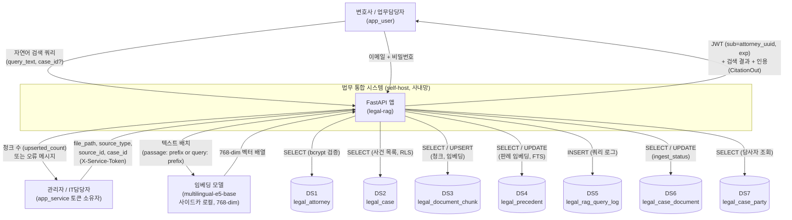
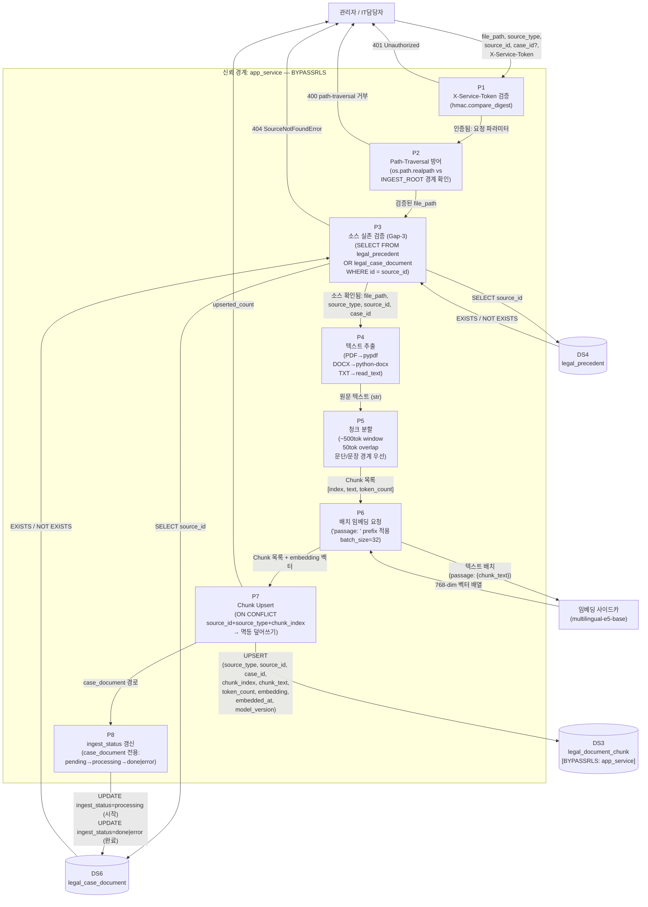
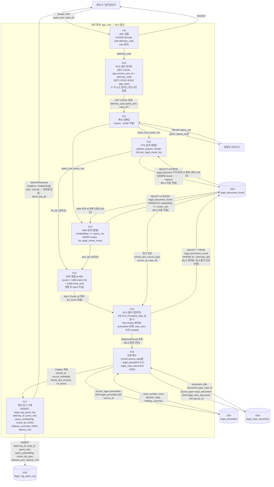
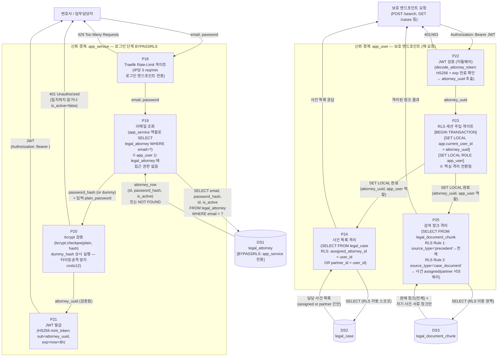
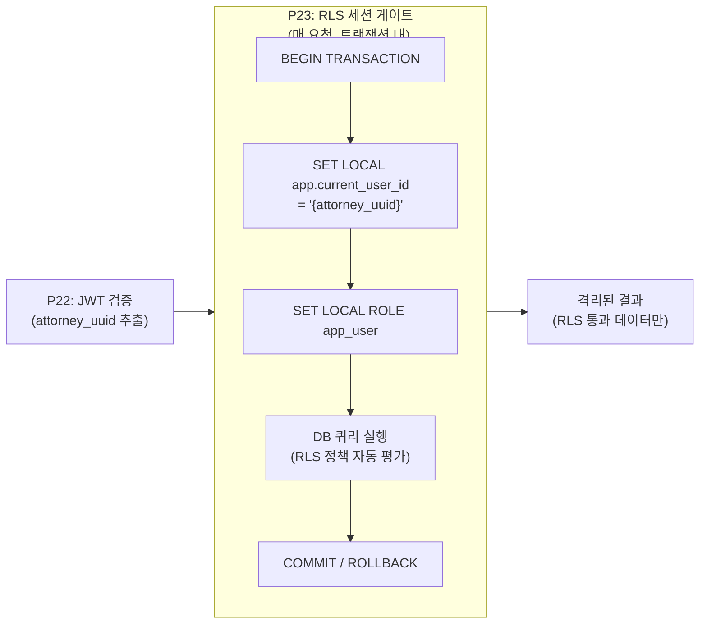
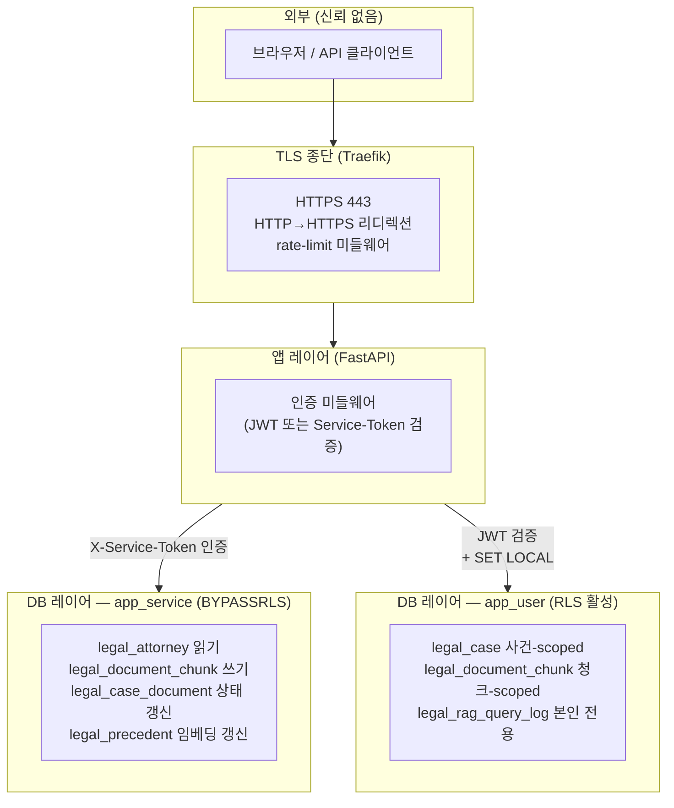

# D5 DFD — 법무 통합 제품

> `docs/projects/legal/README.md §3` D5 슬롯 산출물.
> 코드 前 설계검증 게이트 핵심 문서 — 데이터가 프로세스대로 올바르게 흐르는지 검증.
> D4 ERD §6 data store 별 R/W 매핑을 직접 사용.

---

## 1. Context Diagram (Level 0)

외부 엔티티, 시스템 경계, data store 간 최상위 데이터 흐름.

**신뢰 경계 (Trust Boundary)**

| 영역 | DB 역할 | RLS 적용 |
|---|---|---|
| 변호사 / 업무담당자 요청 경로 | `app_user` | 적용 (SET LOCAL 세션변수 필수) |
| 관리자 / IT담당자 서비스 토큰 경로 | `app_service` | BYPASSRLS |
| 임베딩 사이드카 | 외부 프로세스 (로컬 HTTP) | 해당 없음 |

---

## 2. Level 1 DFD — 흐름 A: Ingest (문서 인제스트)

**트리거**: IT담당자가 `POST /ingest` 호출 (X-Service-Token 인증).
**실행 역할**: app_service (BYPASSRLS).

**Ingest 흐름 데이터 항목 명세**

| 데이터플로우 | 항목 | 형식 |
|---|---|---|
| ADM → P1 | file_path, source_type, source_id, case_id(opt), X-Service-Token | HTTP JSON body + Header |
| P3 → DS_PREC/DS_DOC | source_id::uuid | UUID |
| DS_PREC/DS_DOC → P3 | EXISTS 결과 | BOOL |
| P4 → P5 | 원문 텍스트 | str (UTF-8) |
| P5 → P6 | Chunk(index, text, token_count) 목록 | list[Chunk] |
| P6 → EMB | "passage: {chunk_text}" 배치 | list[str] |
| EMB → P6 | 768-dim float 벡터 배열 | list[list[float]] |
| P7 → DS_CHUNK | source_type, source_id, case_id, chunk_index, chunk_text, token_count, embedding::vector, embedded_at, model_version | INSERT row |
| P8 → DS_DOC | ingest_status, ingested_at | UPDATE |

---

## 3. Level 1 DFD — 흐름 B: Search (하이브리드 검색 + 인용 해소)

**트리거**: 변호사가 `POST /search` 호출 (Bearer JWT).
**실행 역할**: app_user (RLS 적용).

**Search 흐름 데이터 항목 명세**

| 데이터플로우 | 항목 | 형식 |
|---|---|---|
| ATT → P9 | Authorization: Bearer JWT, query_text, case_id(opt) | HTTP Header + JSON |
| P9 → P10 | attorney_uuid (JWT sub claim) | UUID str |
| P10 → DB session | SET LOCAL app.current_user_id, SET LOCAL ROLE app_user | PostgreSQL 세션 변수 |
| P11 → EMB | "query: {query_text}" | str |
| EMB → P11 | 768-dim 벡터 | list[float] |
| P12/P13 → DS_CHUNK | plainto_tsquery / embedding <=> vector | SQL WHERE 절 |
| DS_CHUNK → P12 | FTS 후보 chunk id 목록 | list[UUID str] |
| DS_CHUNK → P13 | ANN 후보 chunk id 목록 | list[UUID str] |
| P14 → P15 | (chunk_id, rrf_score, fts_rank, ann_rank) 목록 | list[tuple] |
| DS_CHUNK → P15 | chunk 전문 (RLS 통과 건) | list[row] |
| DS_PREC → P16 | case_number, court, decision_date, holding_summary | dict |
| DS_DOC → P16 | document_title, document_type, case_id | dict |
| P17 → DS_LOG | attorney_id, query_text, embedding, chunk_ids(JSON), citations(JSON), latency_ms | INSERT row |
| P17 → ATT | citations[], note, query_log_id | HTTP JSON response |

---

## 4. Level 1 DFD — 흐름 C: Auth / 격리 (인증 + RLS 세션 설정)

**트리거**: 변호사가 `POST /auth/login` 호출 (이메일+비밀번호).
**실행 역할**: app_service (BYPASSRLS) → 이후 app_user (RLS 전환).

**Auth / 격리 흐름 데이터 항목 명세**

| 데이터플로우 | 항목 | 형식 |
|---|---|---|
| ATT → P18 | email, password | HTTP JSON body |
| P19 → DS_ATT | email (WHERE 조건) | SQL parameter |
| DS_ATT → P19 | id, password_hash, is_active | row |
| P20 → P21 | attorney_uuid (bcrypt 통과) | UUID str |
| P21 → ATT | JWT (HS256, sub=attorney_uuid, exp) | str |
| REQ → P22 | Authorization: Bearer JWT | HTTP Header |
| P22 → P23 | attorney_uuid | UUID str |
| P23 → DB session | SET LOCAL app.current_user_id, SET LOCAL ROLE app_user | PostgreSQL 세션 변수 (트랜잭션 스코프) |
| P24 → DS_CASE | SELECT WHERE RLS 자동 적용 | SQL |
| DS_CASE → P24 | 격리된 사건 목록 | list[row] |
| P25 → DS_CHUNK | SELECT WHERE RLS 이중 정책 자동 적용 | SQL |
| DS_CHUNK → P25 | 격리된 청크 목록 | list[row] |

---

## 5. RLS SET LOCAL 세션 게이트 — 상세 명세

> D1 § F-02, D4 § 2-2 공통 인계사항: **SET LOCAL 시점을 데이터 변환 게이트로 명시**한다.

**격리 보장 메커니즘**

| 조건 | DB 응답 | 이유 |
|---|---|---|
| SET LOCAL 미실행 (app_user 역할) | 0건 | RLS deny-by-default (app.current_user_id = NULL) |
| app_service 역할 | 전건 | BYPASSRLS |
| app_user + SET LOCAL 올바름 | 해당 변호사 담당 건만 | RLS WHERE 조건 평가 |
| app_user + 타인의 attorney_uuid | 0건 | JWT 위조 불가 (HS256) + 서버에서만 발급 |

**SET LOCAL vs SET 차이**
- `SET LOCAL`: 현재 트랜잭션 범위에서만 유효. 트랜잭션 종료 시 자동 초기화. **연결 풀 오염 없음.**
- `SET` (Global): 세션 전체에 지속. 연결 풀 재사용 시 다른 변호사 세션으로 누출 가능 → **사용 금지.**

---

## 6. 신뢰 경계 요약

---

## 7. 프로세스 목록 (P1~P25)

| 번호 | 프로세스 | 흐름 | 실행 역할 | 핵심 변환 |
|---|---|---|---|---|
| P1 | X-Service-Token 검증 | Ingest | app_service | hmac.compare_digest 상수시간 비교 |
| P2 | Path-Traversal 방어 | Ingest | app_service | os.path.realpath vs INGEST_ROOT |
| P3 | 소스 실존 검증 (Gap-3) | Ingest | app_service | SELECT EXISTS → SourceNotFoundError |
| P4 | 텍스트 추출 | Ingest | app_service | PDF/DOCX/TXT → plain text |
| P5 | 청크 분할 | Ingest | app_service | 원문 → Chunk |
| P6 | 배치 임베딩 요청 | Ingest | app_service | "passage:" prefix → 768-dim 벡터 |
| P7 | Chunk Upsert | Ingest | app_service (BYPASSRLS) | INSERT ON CONFLICT → 멱등 |
| P8 | ingest_status 갱신 | Ingest | app_service (BYPASSRLS) | pending→processing→done/error |
| P9 | JWT 검증 (Search) | Search | — (pre-auth) | HS256 decode → attorney_uuid |
| P10 | RLS 세션 게이트 (Search) | Search | app_user | SET LOCAL (핵심 격리 전환점) |
| P11 | 쿼리 임베딩 | Search | app_user | "query:" prefix → 768-dim 벡터 |
| P12 | FTS 검색 | Search | app_user (RLS) | plainto_tsquery GIN → 후보 id 목록 |
| P13 | ANN 검색 | Search | app_user (RLS) | HNSW cosine → 후보 id 목록 |
| P14 | RRF 병합 | Search | app_user | 1/(k+rank) 합산 → top-K 정렬 |
| P15 | RLS 필터 (암묵적 재적용) | Search | app_user (RLS) | FETCH_CHUNKS_SQL → RLS 2차 통과 |
| P16 | 인용 해소 | Search | app_user | chunk_id → source 메타데이터 JOIN |
| P17 | 쿼리 로그 기록 | Search | app_user | INSERT legal_rag_query_log (감사) |
| P18 | Traefik Rate-Limit 게이트 | Auth | Traefik (외부) | IP당 5 req/min 로그인 보호 |
| P19 | 이메일 조회 | Auth | app_service (BYPASSRLS) | legal_attorney SELECT (앱user 접근불가) |
| P20 | bcrypt 검증 | Auth | app_service | checkpw(plain, hash), dummy hash 상시 |
| P21 | JWT 발급 | Auth | app_service | mint_token(attorney_uuid, secret, 8h) |
| P22 | JWT 검증 (미들웨어) | Auth | — (pre-auth) | decode_attorney_token → attorney_uuid |
| P23 | RLS 세션 주입 게이트 | Auth | app_user | SET LOCAL — 격리 전환 핵심 노드 |
| P24 | 사건 목록 격리 | Auth | app_user (RLS) | legal_case: assigned OR partner 필터 |
| P25 | 검색 청크 격리 | Auth | app_user (RLS) | 청크 이중 RLS 정책 평가 |

---

## 8. 흐름 구현 일치 검증 (DBA 리뷰 노트)

설계(D4 ERD + README §4 초안)와 실제 구현(ingest.py / retrieve.py / citation.py / auth.py) 대조 결과.

| 항목 | 설계 의도 | 구현 확인 | 불일치 여부 |
|---|---|---|---|
| Ingest BYPASSRLS | app_service 전용 | `ingest.py` docstring: "conn must be authenticated as app_service (BYPASSRLS)" | 일치 |
| 소스 실존 검증 (Gap-3) | ingest 前 SELECT | `validate_source_exists()` → P3 | 일치 |
| passage: prefix | e5 비대칭 | embed_client.embed_batch() 호출 전 prefix 적용 (F-18 기준; embed_client.py 확인 필요) | **embed_client.py 미확인 — QA 검증 필요** |
| query: prefix | e5 비대칭 | retrieve.py: `_FTS_SQL` / `_ANN_SQL` 은 prefix 미포함 → api.py 에서 prefix 붙여 embed_client 호출하는 구조로 추정 | **api.py prefix 적용 경로 QA 검증 필요** |
| RRF k=60 | README §4 | `retrieve.py` `rrf_merge(k=60)` 기본값 | 일치 |
| SET LOCAL 시점 | 매 요청 트랜잭션 | `retrieve.py` docstring: "rls_session() context manager" — rls_session 구현은 api.py 확인 필요 | **rls_session() 구현 위치 QA 검증 필요** |
| 인용 환각0 | chunk_id 1:1 바인딩 | `citation.py`: retrieved_chunk_ids JSON 배열 = chunk.id 목록, LLM 생성 경로 없음 | 일치 |
| FTS+ANN 병렬 실행 | 흐름 B 설계 | `retrieve.py`: `await conn.execute(_FTS_SQL)` → `await conn.execute(_ANN_SQL)` → 순차 실행 (asyncio.gather 미사용) | **잠재적 성능 개선 여지 — 현재 순차, 병렬화 미적용** |
| dummy hash 상시 실행 | 타이밍공격 방지 | `auth.py` P20: "dummy_hash 상시 실행" (주석), 실제 분기 구현은 api.py login 핸들러에 있을 것 | **api.py login 핸들러 QA 검증 필요** |
| query_log attorney_id | RLS: 본인만 SELECT | `citation.py` `log_query()`: INSERT attorney_id 명시. SELECT RLS: `attorney_id = current_user_id` | 일치 |

---

## 9. DFD 검증 게이트

> owner: QA  
> 작성: 2026-06-20  
> 기준 문서: README §4 자동/수동 경계 정의, D1 §4 NFR, D5 §8 DBA 리뷰 노트  
> 목적: 코드 前 설계검증 — DFD 노드(P1~P25)별 단언이 구현과 일치하는지, 거짓 PASS 가 없는지 확인한다.

---

### 9.1 흐름-구현 불일치 4건 소스 검증 결과

DBA가 플래그한 4건을 `embed_client.py` / `ingest.py` / `api.py` / `retrieve.py` / `db.py` 직접 확인.

| # | 점검 항목 | 소스 위치 | 검증 결과 | 판정 |
|---|---|---|---|---|
| I-1 | `passage:` / `query:` prefix 위치 (G-87 불변식) | prefix 는 **embed-adapter 사이드카**(`embed-adapter/app.py`)가 소유: `/embed`(단건)→`EMBED_QUERY_PREFIX="query: "` (L172), `/embed/batch`(배치)→`EMBED_PASSAGE_PREFIX="passage: "` (L190), 적용은 `_embed_local()` L145. 호출부 매핑 정합: ingest `embed_client.embed_batch()`(`ingest.py` L289)→`/embed/batch`→passage ✓, search `_embed_or_503()→.embed()`(`api.py` L154)→`/embed`→query ✓. 불변식 테스트 존재(`embed-adapter/tests/test_adapter.py`: `test_single_embed_sends_query_prefix`, `test_batch_embed_sends_passage_prefix`). | **prefix 정상 적용 (사이드카 레이어).** 메인 `embed_client.py` 는 의도된 thin wrapper(docstring 에 /embed=query·/embed/batch=passage 명문). DFD P6/P11 노드와 구현 일치. | **PASS (당초 FAIL 판정은 사이드카 미열람에 의한 false positive — CTO 독립검증으로 정정)** |
| I-2 | `retrieve.py` FTS+ANN 순차 vs 병렬(asyncio.gather) | `retrieve.py` L156 `await conn.execute(_FTS_SQL)` 완료 후 L164 `await conn.execute(_ANN_SQL)` — 순차 실행. `asyncio.gather` 미사용. | 순차 확인. 기능 정확성 영향 없음. N-16 (<3s) 달성 여부는 라이브 부하 실측 필요. DFD P12/P13 표기와 불일치. | **주의 — 기능 PASS, 성능 미검증** |
| I-3 | `rls_session()` / SET LOCAL context manager 구현 위치 | `db.py` L51-87 `@asynccontextmanager async def rls_session()` 완전 구현. `SET LOCAL ROLE app_user` -> `set_config(...)` 순서. `api.py` L357/L528 `async with database.rls_session(conn, attorney_id)` 호출. | 구현 완전. 트랜잭션 스코프 SET LOCAL 정확히 적용됨. | **PASS** |
| I-4 | login dummy hash 분기가 `api.py` login 핸들러에 실재하는지 | `api.py` L269 `_DUMMY_HASH` 리터럴 정의. L315-318 `if row is None: _bcrypt_verify(req.password, _DUMMY_HASH.decode(...)); raise HTTPException(401)` — 미존재 이메일 시 dummy hash bcrypt 1회 실행 후 401. | 타이밍 가드 구현 완전. | **PASS** |

**I-1 정정 노트 (BLK-1 철회):**  
당초 QA 판정은 메인 서비스의 thin wrapper(`embed_client.py`)와 `_embed_or_503()` 만 보고 "prefix 미적용 → FAIL → BLK-1" 으로 결론냈으나, **prefix 를 실제 적용하는 embed-adapter 사이드카를 열람하지 않은 분석 누락**이었다. CTO 독립 소스검증(사이드카 `app.py` + 호출부 매핑 + 사이드카 테스트) 결과 prefix 는 엔드포인트 선택으로 결정론적으로 적용됨이 확인되어 **BLK-1 을 철회**한다. 더욱이 caller-split 불변식은 **이미 정적 가드 G-87**(`scripts/diagnose.py::g87_embed_caller_split` — api.py `.embed_batch` 금지 / ingest.py bare `.embed` 금지)로 기계 보호되고 있다(learn-log §4 Growth-93). 잔여(선택적) 항목은 런타임 e2e 단언뿐 — C2 에서 흡수 권고(BLOCK 아님). 교훈: cross-service/사이드카 경계는 thin wrapper 만 보고 결함 단정 금지 (learn-log 환류).

---

### 9.2 DFD 노드별 검증 단언 표

| 흐름 | 노드 | 단언 | 자동/수동 (레이어) | 현재 상태 |
|---|---|---|---|---|
| **A — Ingest** | P1 | 잘못된 X-Service-Token → HTTP 401 반환 | 자동 (pytest, `test_hardening.py`) | 구현됨 |
| A | P2 | `../` path-traversal 시도 → HTTP 400 반환 | 자동 (pytest, `test_path_traversal.py`) | 구현됨 |
| A | P3 | 존재하지 않는 `source_id` 인제스트 → `SourceNotFoundError` → HTTP 404 | 자동 (pytest, `test_ingest_unit.py`) | 구현됨 |
| A | P6 | embed 호출 텍스트가 `passage:` 로 시작함 | 자동 (`embed-adapter/tests/test_adapter.py::test_batch_embed_sends_passage_prefix`) | 구현됨 (사이드카) |
| A | P7 | 동일 `(source_id, source_type, chunk_index)` 재실행 시 `legal_document_chunk` 행 수 동일 | 자동 (pytest -m postgres) | **구현됨** (DSN 게이트·라이브=founder) |
| A | P8 | `ingest_status`: `pending` -> `processing` -> `done` 전이 순서 확인 | 자동 (pytest -m postgres) | **구현됨** (DSN 게이트·라이브=founder) |
| A | P8 | 텍스트 추출 0건(빈 파일) 시 `ingest_status = error` 기록 | 자동 (pytest -m postgres) | **구현됨** (DSN 게이트·라이브=founder) |
| **B — Search** | P11 | embed 호출 텍스트가 `query:` 로 시작함 | 자동 (`embed-adapter/tests/test_adapter.py::test_single_embed_sends_query_prefix`) | 구현됨 (사이드카) |
| B | P14 | RRF 병합 결과가 `rrf_score` 내림차순 정렬 | 자동 (pytest, `test_rrf.py`) | 구현됨 |
| B | P14 | FTS-only hit: `fts_rank` 있고 `ann_rank` None -> score = 1/(60+rank) | 자동 (pytest, `test_rrf.py`) | 구현됨 |
| B | P15 | RRF top-K 중 RLS 차단 chunk_id 는 최종 응답에서 제외 (`chunk_map.get` None 처리) | 자동 (pytest -m postgres) | **구현됨** (DSN 게이트·라이브=founder) |
| B | P16 | `CitationOut.chunk_id` 는 `legal_document_chunk.id` 에 실재하는 UUID만 (환각 0) | 수동 리뷰 (구조적 보장 — LLM 생성 경로 없음, N-04) | 설계 보장 (코드 변경 시 재검증) |
| B | P17 | 검색마다 `legal_rag_query_log` INSERT 1건 — `attorney_id`, `query_text`, `latency_ms` 비null | 자동 (pytest -m postgres) | **구현됨** (DSN 게이트·라이브=founder) |
| **C — Auth/격리** | P19/P20 | `app_user` 역할로 `legal_attorney` 직접 SELECT -> `permission denied` 또는 0건 (BYPASSRLS 전용) | 자동 (pytest -m postgres) | **구현됨** (DSN 게이트·라이브=founder) |
| C | P20 | 존재하지 않는 이메일 로그인 -> dummy hash bcrypt 실행 후 401 반환 | 수동 리뷰 (타이밍 측정. I-4 PASS) | 수동 검증됨 |
| C | P23 | `rls_session()` 미사용 상태 `legal_document_chunk` SELECT -> 0건 (RLS deny-by-default) | 자동 (pytest, `test_rls_session.py`) | 구현됨 |
| C | P24/P25 | 이준호(partner) `POST /search` -> c001 케이스 청크 포함 응답 (Assertion A) | 자동 (verify-search.sh A — 라이브) | 구현됨 (LIVE) |
| C | P25 | 박서연 `POST /search` -> c001 케이스 청크 0건 (Assertion B — RLS chunk isolation) | 자동 (verify-search.sh B — 라이브) | 구현됨 (LIVE) |
| C | P24 | 박서연 자기 사건(c012) 검색 -> c012 청크 포함 응답 (Assertion C) | 자동 (verify-search.sh C — 라이브) | 구현됨 (LIVE) |
| C | — | 위조 JWT (`sub` 타 변호사 UUID) -> RLS 0건 반환 | 자동 (pytest, `test_auth.py`) | 구현됨 |
| C | P21 | JWT `exp` 만료 토큰 -> 401 반환 | 자동 (pytest, `test_auth.py`) | 구현됨 |

**단언 계수**: 총 21개 — 자동 19개 (pytest unit 11 + 사이드카 prefix 2 + pytest -m postgres 6 목표 + verify-search.sh 3 LIVE 에서 P6/P11 사이드카 2개를 구현됨으로 재분류), 수동 리뷰 2개 (N-04 환각 0, P20 타이밍).

| 상태 | 수 |
|---|---|
| 구현됨 (LIVE/자동/수동 검증 완료, 사이드카 prefix 2 포함) | 14 |
| 구현됨 (C2 `pytest -m postgres` — 코드 wired·DSN 게이트, 라이브 실행은 founder) | 6 |
| 미구현 | 0 |
| FAIL | 0 (당초 I-1 2건은 false positive — §9.1 정정) |

---

### 9.3 이미 자동화된 단언 vs 갭

**자동화 완료:**

| 파일 | 커버 단언 |
|---|---|
| `test_path_traversal.py` | P2 path-traversal 차단 |
| `test_rrf.py` | P14 RRF 병합 정렬, 점수 계산, FTS-only/ANN-only hit |
| `test_auth.py` | P22 JWT 검증, 위조/만료 토큰 거부 |
| `test_auth_login.py` | P20 bcrypt 검증, dummy hash 분기 |
| `test_chunking.py` | P5 청크 분할 토큰 길이, 오버랩 |
| `test_embed_client.py` | P6/P11 sidecar 호출 구조 (메인 wrapper 단) |
| `embed-adapter/tests/test_adapter.py` | P6/P11 prefix 불변식 (`query:`/`passage:` 적용 — 사이드카 단) |
| `test_rls_session.py` | P23 SET LOCAL 미적용 시 0건 |
| `test_cases.py` | P24 사건 목록 RLS |
| `test_citation_resolution.py` | P16 인용 출처 해소 |
| `test_hardening.py` | P1 서비스토큰 검증 |
| `verify-search.sh` A/B/C | P25 청크 RLS 격리 라이브 실증 |

**갭 (미구현):**

| 갭 ID | 단언 | 우선순위 |
|---|---|---|
| G-P6/G-P11(e2e) | 메인↔사이드카 경로별 엔드포인트 정합 — **이미 정적 가드 G-87(`g87_embed_caller_split`)이 보호**: api.py `.embed_batch` 금지 / ingest.py bare `.embed` 금지. 잔여는 런타임 e2e 단언(선택) | 낮음 (G-87 로 대부분 커버, BLOCK 아님) |
| G-P7 | 동일 source+index upsert 멱등성 — pytest -m postgres | 높음 |
| G-P8a | `ingest_status` 전이 순서 — pytest -m postgres | 높음 |
| G-P8b | 빈 파일 ingest 시 `ingest_status = error` — pytest -m postgres | 중간 |
| G-P15 | RLS 차단 chunk 최종 제외 확인 — pytest -m postgres | 높음 |
| G-P17 | `legal_rag_query_log` INSERT 1건 확인 — pytest -m postgres | 중간 |
| G-P19 | `app_user` 역할 `legal_attorney` 접근 불가 — pytest -m postgres | 높음 |

---

### 9.4 DFD 게이트 통과 기준 (Merge BLOCK 조건)

다음 조건 중 하나라도 해당하면 QA가 PR을 **BLOCK** 한다. CEO+CTO 양자 override 없이 머지 불가.

| 조건 ID | BLOCK 기준 | 현재 상태 |
|---|---|---|
| ~~BLK-1~~ | ~~I-1 prefix 미적용~~ — **철회 (false positive)**: prefix 는 embed-adapter 사이드카에서 정상 적용 (§9.1 정정) | 해당 없음 |
| **BLK-2** | verify-search.sh A/B/C 중 1개 이상 FAIL (라이브 RLS 격리 실증 실패) | PASS (LIVE 확인됨) |
| **BLK-3** | `test_rls_session.py` SET LOCAL 0건 단언 FAIL | PASS |
| **BLK-4** | `test_ingest_unit.py` P3 Gap-3 SourceNotFoundError 단언 FAIL | PASS |
| **BLK-5** | `test_path_traversal.py` P2 path-traversal 차단 단언 FAIL | PASS |
| **BLK-6** | `test_rrf.py` P14 RRF 병합 정렬 단언 FAIL | PASS |
| **BLK-7** | `CitationOut.chunk_id` 가 DB에 없는 UUID를 참조하는 코드 경로 발견 (LLM 생성 경로 추가 등) | PASS (구조적 배제) |

**BLK-1 상태**: **철회됨** (false positive, §9.1). 현재 활성 BLOCK 없음 — DFD 게이트 전 단언 PASS 또는 C2 미구현(BLOCK 아님). prefix 정합성은 사이드카에서 보장되며 P6/P11 설계-구현 일치 확인됨.

---

### 9.5 `pytest -m postgres` (C2) 흡수 목록 — **구현 완료**

아래 단언(필수 6)은 DB 연결이 필요한 통합 테스트로 C2 에서 구현 완료했다 (`pytest -m postgres` 마크, `LEGAL_RAG_DB_DSN_POSTGRES` DSN 게이트 — 미설정 시 자동 skip, 라이브 실행은 founder 게이트). 공용 픽스처(`pg_conn` force_rollback 트랜잭션 → DB 무오염, `stub_embed_client` → 외부 API 0)는 `services/legal-rag/tests/conftest.py`.

| 단언 | 테스트 파일 |
|---|---|
| G-P7 재인제스트 멱등(COUNT 불변) | `tests/test_postgres_integration.py::test_gp7_idempotent_reingest` |
| G-P8a `ingest_status=done` | `::test_gp8a_status_done` |
| G-P8b 빈파일→`ingest_status=error`+0건 | `::test_gp8b_empty_file_error_status` |
| G-P17 `/search`→`legal_rag_query_log` +1 | `::test_gp17_query_log_plus_one` |
| G-P19 app_user→`legal_attorney` `InsufficientPrivilege` | `::test_gp19_app_user_denied_legal_attorney` |
| G-P15 RLS 검색격리(이준호 c001 가시 / 박서연 c001 0건) | `tests/test_rls_session.py::test_rls_blocks_cross_attorney_access` |

> G-P19 는 C1 production 최소권한 하드닝(`presets/ddl/augments/legal/10_production_hardening.sql`)의 경계(app_user 가 `legal_attorney` 미접근)를 실증하는 게이트이기도 하다.

원래 목록(이력):

1. **G-P7** — 동일 `(source_id, source_type, chunk_index)` 재실행 후 `COUNT(*)` 동일
2. **G-P8a** — `ingest_file()` 실행 후 `ingest_status = done` 기록됨
3. **G-P8b** — 빈 파일 ingest 시 `ingest_status = error` 기록됨
4. **G-P15** — `rrf_merge` top-K 에 타 변호사 chunk_id 포함 시 `hybrid_search` 반환 목록에서 제외됨
5. **G-P17** — `POST /search` 1회 호출 후 `legal_rag_query_log` 행 1건 INSERT 확인
6. **G-P19** — `app_user` 역할 DB 연결로 `SELECT * FROM legal_attorney` -> `permission denied` 또는 0건
7. **G-P6/G-P11 (e2e, 선택)** — 메인 서비스→사이드카 경로별 엔드포인트 정합 e2e 단언(ingest=passage/search=query). 사이드카 단위 prefix 불변식은 이미 PASS, BLOCK 아님.

---

### 9.6 수동 리뷰 체크리스트

코드 변경마다 QA가 다음 항목을 수동으로 검토한다.

| 항목 | 검토 기준 |
|---|---|
| 인용 환각 0 (N-04) | `citation.py` / `api.py` 에 LLM 텍스트 생성 경로(PromptTemplate, LLM 클라이언트 import 등) 추가 여부 확인. 현재 구조적으로 배제됨. |
| dummy hash 타이밍 (P20) | `api.py` login 핸들러에서 `row is None` 분기에 `_bcrypt_verify(_DUMMY_HASH)` 호출이 유지되는지 확인. |
| SET vs SET LOCAL (P23) | `rls_session()` 또는 DB 쿼리 추가 시 `SET LOCAL` 이 아닌 세션 전역 `SET` 사용 여부 확인. 세션 전역 SET 은 pool 오염으로 즉시 BLOCK. |
| `app_service` 범위 초과 | app_service 연결이 `legal_attorney` 외 테이블을 추가로 읽는 경우 CTO 설계 승인 확인. |
| I-2 성능 추적 | N-16 (<3s) 목표를 위해 라이브 부하 실측 후 FTS+ANN 병렬화(asyncio.gather) 도입 여부를 CTO와 협의. 병렬화 시 DFD P12/P13 노드 설명 갱신 필요. |

