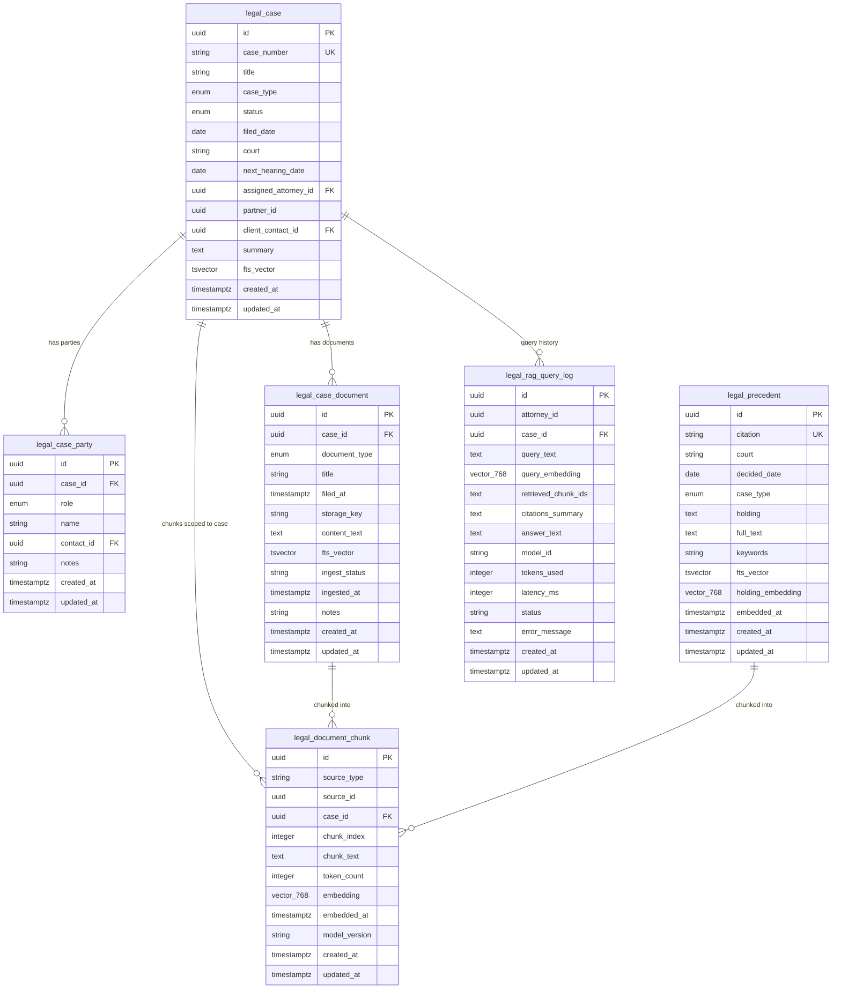

# ERD — legal-rag-mvp

## Entity Relationship Diagram (Mermaid)



## Cardinality Notes

| Relationship | Type | Note |
|---|---|---|
| legal_case → legal_case_party | 1:N | Multiple parties per case |
| legal_case → legal_case_document | 1:N | Append-only audit trail |
| legal_case_document → legal_document_chunk | 1:N | Ingest creates N chunks per doc |
| legal_precedent → legal_document_chunk | 1:N | Full-text chunked for RAG |
| legal_document_chunk (source_type='precedent') | polymorphic | source_id → legal_precedent.id |
| legal_document_chunk (source_type='case_document') | polymorphic | source_id → legal_case_document.id |
| legal_rag_query_log → legal_document_chunk | M:N logical | via retrieved_chunk_ids (JSON array) |

## Citation Chain (anti-hallucination path)

```
RAG answer
  └── references chunk_ids from legal_rag_query_log.retrieved_chunk_ids
        └── legal_document_chunk.id
              ├── source_type='precedent'    → legal_precedent.citation  (human-readable cite)
              └── source_type='case_document' → legal_case_document.id + title
```

Every cited source traces to a DB PK. Engineer must validate: answer citations
must be a subset of `retrieved_chunk_ids` in the same query log row.
